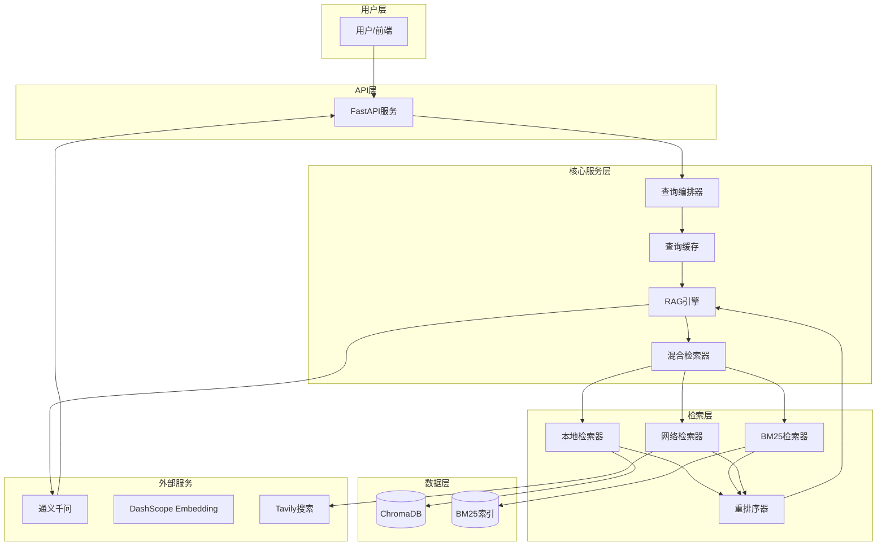
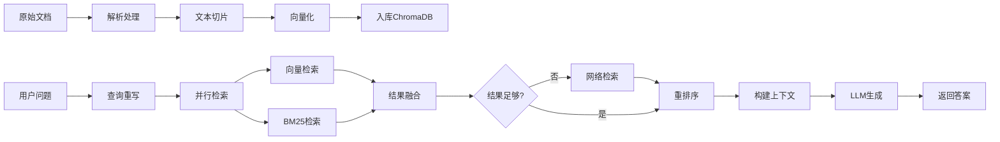

# 工程质检RAG系统（ChromaDB版本）

> 公路工程质量检测智能问答系统 - 使用ChromaDB向量数据库

## 项目概述

基于RAG（检索增强生成）技术的公路工程质量检测智能问答系统。系统支持本地知识库检索与网络检索的混合检索，能够准确回答工程质量检测相关的技术问题，并提供可追溯的来源依据。

### 核心特性

- **混合检索**：向量检索 + BM25关键词检索 + 网络检索
- **并行执行**：向量检索和BM25同时执行，提升响应速度
- **智能缓存**：内存缓存热门查询，命中时<100ms响应
- **流式输出**：SSE流式返回答案，提升用户体验
- **来源追溯**：每个答案可追溯到具体文档和章节
- **本地优先**：优先使用本地知识库，网络检索作为补充

### 版本说明

| 分支 | 向量数据库 | 端口 | 适用场景 |
|------|-----------|------|---------|
| `main` | Milvus | 5001 | 生产环境、大规模数据 |
| `chromadb` | ChromaDB | 5002 | 开发测试、中小规模数据 |

---

## 目录

- [项目概述](#项目概述)
- [系统架构](#系统架构)
- [技术栈与选型原因](#技术栈与选型原因)
- [核心功能模块](#核心功能模块)
- [实现路线](#实现路线)
- [快速开始](#快速开始)
- [API接口](#api接口)
- [项目结构](#项目结构)
- [配置说明](#配置说明)
- [问答结果控制](#问答结果控制)
- [验收标准](#验收标准)

---

## 系统架构



---

## 技术栈与选型原因

| 组件 | 技术选择 | 选型原因 |
|------|---------|---------|
| 后端框架 | FastAPI | 异步支持、自动文档、类型提示 |
| 向量数据库 | ChromaDB | 轻量级、易部署、本地存储 |
| Embedding | DashScope API | 阿里云服务、中文支持好 |
| LLM | Qwen (通义千问) | 中文理解能力强、性价比高 |
| 关键词检索 | rank_bm25 + jieba | 经典算法、中文分词支持 |
| 网络检索 | Tavily API | 专业搜索API、结果质量高 |

---

## 核心功能模块

### 1. 数据处理模块
- **Markdown解析器**：解析用户转换的Markdown文档
- **Excel解析器**：处理表格数据，转换为描述性文本
- **切片器**：文本分块，支持段落切分和固定大小切分

### 2. 检索模块
- **向量检索**：使用ChromaDB进行语义相似度检索
- **BM25检索**：关键词匹配检索，补充向量检索不足
- **网络检索**：Tavily API搜索权威来源
- **重排序器**：本地优先策略，结果融合排序

### 3. 生成模块
- **RAG引擎**：检索增强生成核心逻辑
- **流式生成**：SSE实时返回答案

### 4. 优化模块
- **智能缓存**：内存缓存热门查询
- **并行检索**：向量检索和BM25同时执行

---

## 实现路线



---

## 快速开始

### 1. 安装依赖

```bash
pip install -r requirements.txt
```

### 2. 配置环境变量

```bash
cp .env.example .env
# 编辑.env文件，填入API Key
```

### 3. 数据入库

将Markdown和Excel文件放入 `data/processed/` 目录，然后执行：

```bash
python scripts/ingest.py
```

### 4. 启动服务

```bash
python -m uvicorn app.main:app --host 127.0.0.1 --port 5002
```

访问 http://localhost:5002/docs 查看API文档

---

## API接口

### 1. 问答接口

**请求**：
```bash
POST /api/v1/query
Content-Type: application/json

{
    "question": "土方路基压实度检测频率是多少？",
    "options": {
        "use_web_search": true,
        "top_k": 5
    }
}
```

**响应**：
```json
{
    "code": 0,
    "data": {
        "answer": "根据JTG F80-1-2017《公路工程质量检验评定标准》...",
        "sources": [...],
        "query_time_ms": 1234,
        "used_web_search": false
    }
}
```

### 2. 流式问答接口

**请求**：
```bash
POST /api/v1/query/stream
Content-Type: application/json

{
    "question": "土方路基压实度检测频率是多少？"
}
```

**响应**（SSE流式）：
```
event: message
data: {"type": "answer", "content": "根据JTG F80-1-2017..."}

event: done
data: {"sources": [...], "query_time_ms": 1234}
```

### 3. 来源追溯接口

```bash
GET /api/v1/source/{chunk_id}
```

### 4. 健康检查接口

```bash
GET /api/v1/health
```

---

## 项目结构

```
工程质检RAG系统/
├── app/
│   ├── api/routes/          # API路由
│   ├── core/                # 核心服务
│   ├── retrievers/          # 检索模块
│   ├── processors/          # 数据处理
│   ├── models/              # 数据模型
│   ├── utils/               # 工具函数
│   ├── config.py            # 配置管理
│   └── main.py              # FastAPI入口
├── data/
│   ├── raw/                 # 原始数据
│   ├── processed/           # 处理后数据
│   └── vectordb/            # 向量数据库
│       ├── chroma/          # ChromaDB数据
│       └── bm25_index.pkl   # BM25索引
├── scripts/
│   └── ingest.py            # 数据入库脚本
├── docs/                    # 项目文档
├── test_api.py              # 测试脚本
├── requirements.txt         # 依赖清单
├── .env.example             # 配置模板
└── README.md                # 项目说明
```

---

## 配置说明

### 必须配置的API Key

| 配置项 | 说明 | 获取方式 |
|--------|------|---------|
| `DASHSCOPE_API_KEY` | 通义千问API Key | https://dashscope.console.aliyun.com/ |
| `TAVILY_API_KEY` | Tavily搜索API Key | https://tavily.com/ |

### ChromaDB配置

| 配置项 | 默认值 | 说明 |
|--------|--------|------|
| `CHROMA_PERSIST_DIR` | `./data/vectordb/chroma` | 数据持久化目录 |
| `CHROMA_COLLECTION_NAME` | `engineering_qa` | 集合名称 |

---

## 问答结果控制

### 响应数据结构

```python
class QueryData(BaseModel):
    answer: str                    # LLM生成的答案
    sources: List[SourceInfo]      # 来源信息列表
    query_time_ms: int             # 查询耗时(毫秒)
    used_web_search: bool          # 是否使用了网络检索

class SourceInfo(BaseModel):
    chunk_id: str                  # 切片ID
    doc_id: str                    # 文档ID
    doc_name: str                  # 文档名称
    page: Optional[int]            # 页码
    section: Optional[str]         # 章节
    content: str                   # 原文内容（截取前500字符）
    source_type: SourceType        # 来源类型: local/web
    url: Optional[str]             # URL（仅网络来源）
```

### 关键控制参数

| 参数 | 位置 | 默认值 | 作用 |
|------|------|--------|------|
| `SYSTEM_PROMPT` | rag_engine.py 第20-37行 | - | LLM角色设定、回答原则 |
| `max_context_length` | rag_engine.py 第69行 | 6000 | 上下文最大字符数 |
| `max_tokens` | rag_engine.py 第166行 | 1000 | 生成答案最大token数 |
| `temperature` | rag_engine.py 第167行 | 0.1 | 生成温度 |

---

## 验收标准

| 指标 | 目标值 | 实际值 |
|------|--------|--------|
| 检索准确率 | ≥ 80% | 待测试 |
| 单次问答延迟 | < 20秒 | < 10秒 |
| 缓存命中延迟 | < 100ms | ✅ |
| 答案来源可追溯 | 100% | ✅ |
| 网络检索补充 | 支持 | ✅ |

---

**项目版本**：v1.1.0-chromadb  
**分支**：chromadb  
**向量数据库**：ChromaDB  
**服务端口**：5002
