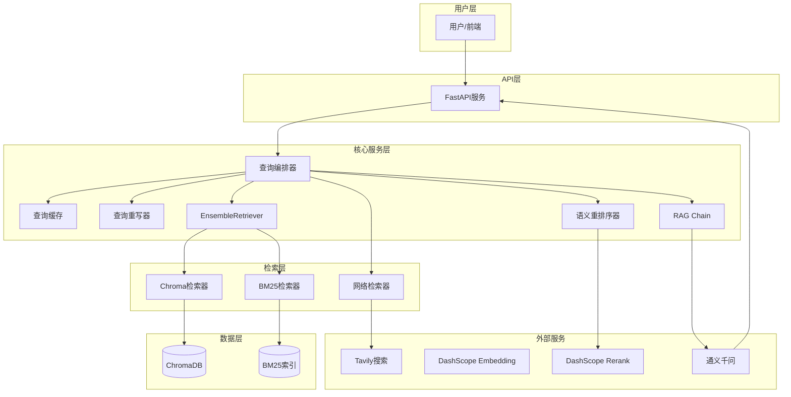
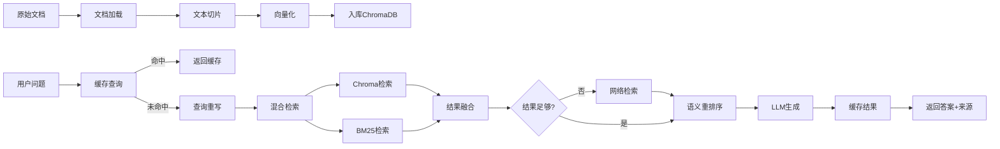

# 工程质检RAG系统

> 公路工程质量检测智能问答系统 - 使用LangChain框架 + ChromaDB向量数据库

## 项目概述

基于RAG（检索增强生成）技术的公路工程质量检测智能问答系统。系统支持本地知识库检索与网络检索的混合检索，能够准确回答工程质量检测相关的技术问题，并提供可追溯的来源依据。

### 核心特性

- **LangChain框架**：基于LangChain 0.3.x重构，使用LCEL链式调用语法
- **混合检索**：向量检索 + BM25关键词检索 + 网络检索
- **语义重排序**：DashScope gte-rerank模型语义重排序，不可用时自动回退到本地优先策略
- **LLM查询重写**：规则重写 + LLM智能重写，将口语化查询转为规范术语
- **智能缓存**：内存/Redis双层缓存，命中时<100ms响应，Redis不可用时自动降级
- **流式输出**：SSE流式返回答案（含完整来源信息），提升用户体验
- **来源追溯**：每个答案可追溯到具体文档和章节，支持查看前后文上下文
- **本地优先**：优先使用本地知识库，网络检索作为补充
- **检索并行化**：本地检索与网络检索并行执行，降低查询延迟
- **Web管理后台**：Vue 3 + Element Plus 管理界面，支持文档上传、知识库管理
- **单元测试覆盖**：66个测试用例覆盖6个核心模块
- **完整类型注解**：0个 `-> object` 残留，使用 TYPE_CHECKING 避免循环导入
- **配置化CORS**：跨域来源支持环境变量配置，生产环境可限制具体域名

---

## 目录

- [项目概述](#项目概述)
- [系统架构](#系统架构)
- [技术栈与选型原因](#技术栈与选型原因)
- [核心功能模块](#核心功能模块)
- [实现路线](#实现路线)
- [快速开始](#快速开始)
- [API接口](#api接口)
- [项目结构](#项目结构)
- [配置说明](#配置说明)
- [问答结果控制](#问答结果控制)
- [验收标准](#验收标准)

---

## 系统架构


```mermaid
graph TB
    subgraph 用户层
        U[用户/前端]
    end
    
    subgraph API层
        API[FastAPI服务]
    end
    
    subgraph 核心服务层
        ORCH[查询编排器]
        CHAIN[RAG Chain]
        ENSEMBLE[EnsembleRetriever]
        CACHE[查询缓存]
        REWRITER[查询重写器]
        RERANKER[语义重排序器]
    end
    
    subgraph 检索层
        CHROMA[Chroma检索器]
        BM25[BM25检索器]
        WEB[网络检索器]
    end
    
    subgraph 数据层
        VDB[(ChromaDB)]
        BM25_IDX[(BM25索引)]
    end
    
    subgraph 外部服务
        LLM[通义千问]
        EMBED[DashScope Embedding]
        RERANK[DashScope Rerank]
        SEARCH[Tavily搜索]
    end
    
    U --> API
    API --> ORCH
    ORCH --> CACHE
    ORCH --> REWRITER
    ORCH --> ENSEMBLE
    ENSEMBLE --> CHROMA
    ENSEMBLE --> BM25
    ORCH --> WEB
    ORCH --> RERANKER
    RERANKER --> RERANK
    CHROMA --> VDB
    BM25 --> BM25_IDX
    WEB --> SEARCH
    ORCH --> CHAIN
    CHAIN --> LLM
    LLM --> API
```

---

## 技术栈与选型原因

| 组件 | 技术选择 | 选型原因 |
|------|---------|---------|
| 后端框架 | FastAPI | 异步支持、自动文档、类型提示 |
| LLM框架 | LangChain 0.3.x | 标准化组件、LCEL语法、生态成熟 |
| 向量数据库 | ChromaDB | 轻量级、易部署、本地存储 |
| Embedding | DashScope API | 阿里云服务、中文支持好 |
| LLM | Qwen (通义千问) | 中文理解能力强、性价比高 |
| 语义重排序 | DashScope gte-rerank | 语义相关性排序，提升检索精度 |
| 关键词检索 | rank_bm25 + jieba | 经典算法、中文分词支持 |
| 网络检索 | Tavily API | 专业搜索API、结果质量高 |

---

## 核心功能模块

### 1. 数据处理模块
- **文档加载器**：支持Markdown、Excel等格式解析
- **文本切片器**：智能文本分块，支持段落切分和固定大小切分，保留表格完整性

### 2. 检索模块
- **Chroma检索器**：使用ChromaDB进行语义相似度检索
- **BM25检索器**：关键词匹配检索，补充向量检索不足
- **EnsembleRetriever**：融合向量检索和BM25结果（RRF算法）
- **网络检索器**：Tavily API搜索权威来源
- **语义重排序器**：DashScope gte-rerank模型重排序，不可用时回退到本地优先策略

### 3. 生成模块
- **RAG Chain**：基于LCEL的检索增强生成核心逻辑
- **流式生成**：SSE实时返回答案（含完整来源信息）

### 4. 查询优化模块
- **查询重写器**：规则重写（术语映射+句式规范化）+ LLM智能重写
- **智能缓存**：内存缓存热门查询，TTL 1小时
- **来源上下文**：支持查看切片前后文，定位到同一文档的相邻切片

### 5. 基础设施模块
- **LLM工厂**：通义千问单例管理
- **Embedding工厂**：DashScope Embedding单例管理
- **向量存储**：ChromaDB集合管理

---

## 实现路线


```mermaid
flowchart LR
    A[原始文档] --> B[文档加载]
    B --> C[文本切片]
    C --> D[向量化]
    D --> E[入库ChromaDB]
    
    F[用户问题] --> G[缓存查询]
    G -->|命中| H[返回缓存]
    G -->|未命中| G2[查询重写]
    G2 --> I[混合检索]
    I --> J[Chroma检索]
    I --> K[BM25检索]
    J --> L[结果融合]
    K --> L
    L --> M{结果足够?}
    M -->|否| N[网络检索]
    N --> O[语义重排序]
    M -->|是| O
    O --> P[LLM生成]
    P --> Q[缓存结果]
    Q --> R[返回答案+来源]
```

---

## 快速开始

### 1. 安装依赖

```bash
pip install -r requirements.txt
```

### 2. 配置环境变量

```bash
cp .env.example .env
# 编辑.env文件，填入API Key
```

### 3. 数据入库

将Markdown和Excel文件放入 `data/processed/` 目录，然后执行：

```bash
python scripts/ingest.py
```

### 4. 启动服务

```bash
python -m uvicorn app.main:app --host 127.0.0.1 --port 5002
```

访问 http://localhost:5002/docs 查看API文档

### 5. 启动前端（可选）

```bash
cd frontend
npm install
npm run dev
```

访问 http://localhost:3000 使用Web界面

### 6. 运行测试

```bash
python -m pytest tests/ -v
```

### 7. Docker部署

```bash
# 一键部署（后端 + Nginx前端代理）
docker-compose up -d

# 访问
# 前端: http://localhost:80
# API文档: http://localhost:5002/docs
```

> 部署架构：`rag-app` (gunicorn 4 workers, 非root用户) + `nginx` (静态文件 + API反向代理)，双服务健康检查。

---

## API接口

### 1. 问答接口

**请求**：
```bash
POST /api/v1/query
Content-Type: application/json

{
    "question": "土方路基压实度检测频率是多少？",
    "options": {
        "use_web_search": true,
        "top_k": 5
    }
}
```

**响应**：
```json
{
    "code": 0,
    "data": {
        "answer": "根据JTG F80-1-2017《公路工程质量检验评定标准》...",
        "sources": [...],
        "query_time_ms": 1234,
        "used_web_search": false
    }
}
```

### 2. 流式问答接口

**请求**：
```bash
POST /api/v1/query/stream
Content-Type: application/json

{
    "question": "土方路基压实度检测频率是多少？"
}
```

**响应**（SSE流式）：
```
event: message
data: {"type": "answer", "content": "根据JTG F80-1-2017..."}

event: done
data: {"sources": [...], "query_time_ms": 1234, "used_web_search": false}
```

### 3. 来源追溯接口

```bash
GET /api/v1/source/{chunk_id}
```

**响应**：
```json
{
    "code": 0,
    "data": {
        "chunk_id": "abc123",
        "doc_id": "def456",
        "doc_name": "JTG F80-1-2017 公路工程质量检验评定标准",
        "full_content": "完整原文内容...",
        "context_before": "前一个切片内容...",
        "context_after": "后一个切片内容..."
    }
}
```

### 4. 管理接口（新增 v2.2.0）

| 方法 | 路径 | 功能 |
|------|------|------|
| `POST` | `/api/v1/admin/documents/upload` | 上传文档（MD/XLS/XLSX） |
| `GET` | `/api/v1/admin/documents` | 获取已入库文档列表 |
| `DELETE` | `/api/v1/admin/documents/{doc_id}` | 删除文档及切片 |
| `POST` | `/api/v1/admin/knowledge/rebuild` | 全量重建知识库 |
| `GET` | `/api/v1/admin/stats` | 知识库统计详情 |

### 5. 健康检查接口

```bash
GET /api/v1/health
```

---

## 项目结构

```
工程质检RAG系统/
├── app/
│   ├── api/routes/          # API路由
│   │   ├── query.py         # 问答接口（含流式）
│   │   ├── source.py        # 来源追溯接口
│   │   └── health.py        # 健康检查接口
│   ├── chains/              # LangChain Chains
│   │   ├── rag_chain.py     # RAG Chain（LCEL）
│   │   └── prompts.py       # Prompt模板
│   ├── core/                # 核心服务
│   │   └── orchestrator.py  # 查询编排器（含缓存、上下文）
│   ├── retrievers/          # 检索模块
│   │   ├── chroma_retriever.py   # Chroma向量检索
│   │   ├── bm25_retriever.py     # BM25关键词检索
│   │   ├── ensemble_retriever.py # 混合检索融合
│   │   ├── reranker.py           # 语义重排序器
│   │   └── web_retriever.py      # 网络检索器
│   ├── processors/          # 数据处理
│   │   ├── document_loaders.py   # 文档加载（MD/Excel）
│   │   ├── chunker.py            # 文本切片器
│   │   └── query_rewriter.py     # 查询重写器
│   ├── infrastructure/      # 基础设施（LLM、Embedding、向量存储）
│   ├── models/              # 数据模型
│   ├── utils/               # 工具函数（缓存、日志）
│   ├── config.py            # 配置管理
│   └── main.py              # FastAPI入口
├── data/
│   ├── raw/                 # 原始数据
│   ├── processed/           # 处理后数据
│   └── vectordb/            # 向量数据库
│       ├── chroma/          # ChromaDB数据
│       └── bm25_index.pkl   # BM25索引
├── frontend/                # 前端项目（Vue 3 + Element Plus）
│   ├── src/views/           # ChatView / AdminView / NotFound
│   ├── src/components/      # 8个可复用组件
│   ├── src/api/             # API封装层（SSE + Axios）
│   └── src/router/          # 路由配置（含404兜底）
├── tests/                   # 单元测试（66个用例）
├── scripts/
│   └── ingest.py            # 数据入库脚本（幂等模式）
├── docs/                    # 项目文档
├── test_api.py              # API集成测试脚本
├── requirements.txt         # 依赖清单（固定版本号）
├── .env.example             # 配置模板
├── Dockerfile               # Docker镜像（gunicorn + 非root）
├── docker-compose.yml       # Docker编排（后端 + Nginx）
├── nginx.conf               # Nginx反向代理配置
├── pyproject.toml           # 项目元数据 + pytest配置
└── README.md                # 项目说明
```

---

## 配置说明

### 必须配置的API Key

| 配置项 | 说明 | 获取方式 |
|--------|------|---------|
| `DASHSCOPE_API_KEY` | 通义千问API Key（用于LLM、Embedding和重排序） | https://dashscope.console.aliyun.com/ |
| `TAVILY_API_KEY` | Tavily搜索API Key | https://tavily.com/ |

### ChromaDB配置

| 配置项 | 默认值 | 说明 |
|--------|--------|------|
| `CHROMA_PERSIST_DIR` | `./data/vectordb/chroma` | 数据持久化目录 |
| `CHROMA_COLLECTION_NAME` | `engineering_qa` | 集合名称 |

### LLM配置

| 配置项 | 默认值 | 说明 |
|--------|--------|------|
| `LLM_MODEL` | `qwen-plus` | LLM模型名称（推荐qwen-plus，精度更高、幻觉更少） |
| `EMBEDDING_MODEL` | `text-embedding-v2` | Embedding模型名称 |

### CORS配置

| 配置项 | 默认值 | 说明 |
|--------|--------|------|
| `CORS_ORIGINS` | `["*"]` | 允许的跨域来源列表，生产环境应设置为具体域名（与`allow_credentials`自动互斥） |

### 重排序配置

| 配置项 | 默认值 | 说明 |
|--------|--------|------|
| `USE_SEMANTIC_RERANK` | `false` | 是否启用DashScope语义重排序（需要API支持gte-rerank模型） |

### Redis缓存配置（可选）

| 配置项 | 默认值 | 说明 |
|--------|--------|------|
| `REDIS_URL` | 无 | Redis连接URL，不配置则使用内存缓存 |
| `REDIS_CACHE_TTL` | `3600` | Redis缓存过期时间(秒) |

---

## 问答结果控制

### 响应数据结构

```python
class QueryData(BaseModel):
    answer: str                    # LLM生成的答案
    sources: List[SourceInfo]      # 来源信息列表
    query_time_ms: int             # 查询耗时(毫秒)
    used_web_search: bool          # 是否使用了网络检索

class SourceInfo(BaseModel):
    chunk_id: str                  # 切片ID
    doc_id: str                    # 文档ID
    doc_name: str                  # 文档名称
    page: Optional[int]            # 页码
    section: Optional[str]         # 章节
    content: str                   # 原文内容（截取前500字符）
    source_type: SourceType        # 来源类型: local/web
    url: Optional[str]             # URL（仅网络来源）
```

### 关键控制参数

| 参数 | 位置 | 默认值 | 作用 |
|------|------|--------|------|
| `SYSTEM_PROMPT` | app/chains/prompts.py | - | LLM角色设定、回答原则 |
| `max_context_length` | app/config.py | 6000 | 上下文最大字符数 |
| `max_tokens` | app/config.py | 1000 | 生成答案最大token数 |
| `temperature` | app/config.py | 0.1 | 生成温度 |
| `vector_weight` | app/config.py | 0.5 | 向量检索权重 |
| `bm25_weight` | app/config.py | 0.5 | BM25检索权重（数值密集型文档提升至0.5） |
| `local_weight` | app/config.py | 0.7 | 本地结果重排序权重（回退策略） |
| `web_weight` | app/config.py | 0.3 | 网络结果重排序权重（回退策略） |

---

## 验收标准

| 指标 | 目标值 | 实际值 |
|------|--------|--------|
| 检索准确率 | ≥ 80% | 待测试 |
| 单次问答延迟 | < 20秒 | ~1.5-3s |
| 缓存命中延迟 | < 100ms | ✅ |
| 答案来源可追溯 | 100% | ✅ |
| 网络检索补充 | 支持 | ✅ |
| 语义重排序 | 支持 | ✅ (默认关闭，可按需开启) |
| LLM查询重写 | 支持 | ✅ |
| 来源上下文 | 支持 | ✅ |
| LangChain集成 | 完成 | ✅ |
| 单元测试覆盖 | ≥ 70% | ✅ 66 tests |
| 检索并行化 | 支持 | ✅ |
| Redis缓存 | 支持 | ✅ 可选降级 |
| 前端界面 | 完成 | ✅ Vue 3 |
| 管理后台 | 完成 | ✅ |
| Docker部署 | 完成 | ✅ gunicorn + Nginx |
| 非root容器 | 完成 | ✅ |
| 幂等入库 | 完成 | ✅ |
| XSS防护 | 完成 | ✅ |

---

**项目版本**：v2.3.0  
**框架**：LangChain 0.3.x  
**前端**：Vue 3 + Element Plus + Vite  
**向量数据库**：ChromaDB  
**后端端口**：5002 | **前端端口**：3000
