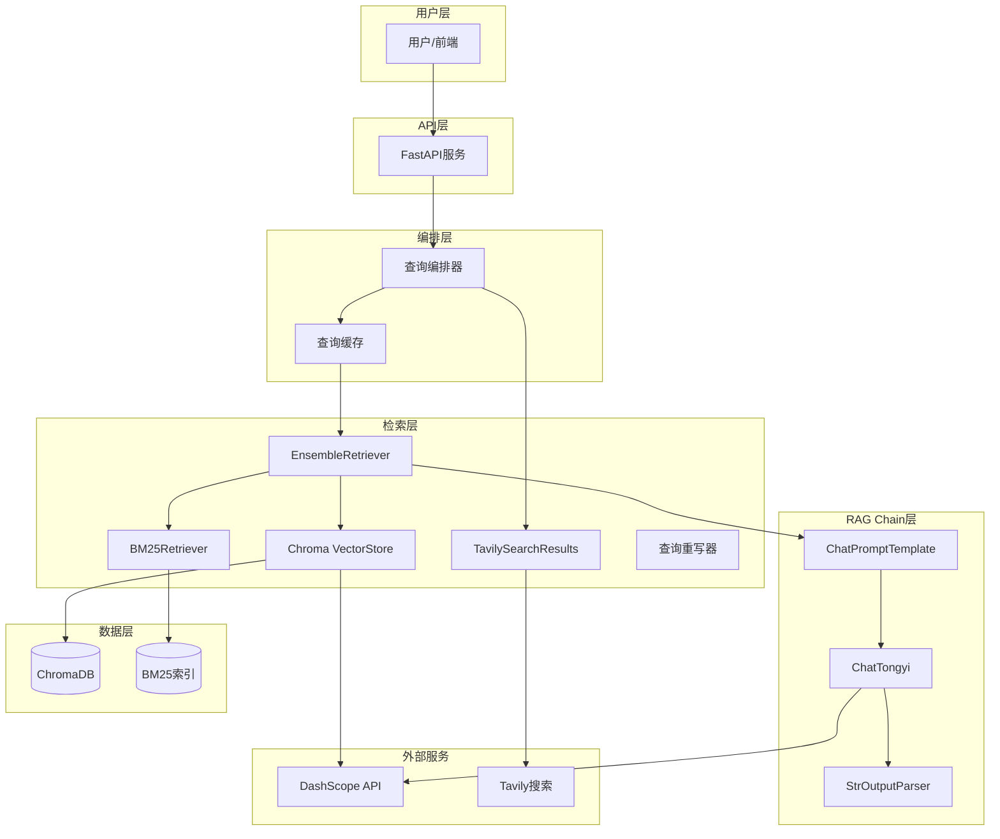
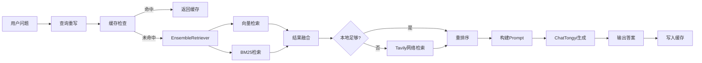

# DESIGN - LangChain重构工程质检RAG系统

## 整体架构图



## 分层设计

### 1. 基础设施层 (app/infrastructure/)
- `llm.py`: ChatTongyi实例工厂
- `embeddings.py`: DashScopeEmbeddings实例工厂
- `vectorstore.py`: Chroma VectorStore工厂

### 2. 数据处理层 (app/processors/)
- `document_loaders.py`: Markdown/Excel → LangChain Document转换
- `chunker.py`: 保留自定义切片器（表格支持），输出LangChain Document
- `query_rewriter.py`: 保留查询重写逻辑

### 3. 检索层 (app/retrievers/)
- `chroma_retriever.py`: 基于Chroma VectorStore的检索器
- `bm25_retriever.py`: 基于LangChain BM25Retriever
- `web_retriever.py`: 基于TavilySearchResults
- `ensemble_retriever.py`: 基于EnsembleRetriever的混合检索
- `reranker.py`: 保留自定义重排序逻辑

### 4. Chain层 (app/chains/)
- `rag_chain.py`: LCEL RAG Chain定义
- `prompts.py`: Prompt模板

### 5. 编排层 (app/core/)
- `orchestrator.py`: 查询编排器（缓存+检索+Chain）

### 6. API层 (app/api/routes/)
- `query.py`: 问答接口（同步+流式）
- `source.py`: 来源追溯
- `health.py`: 健康检查

## 数据流向图



## 接口契约定义

### 输入
```python
class QueryRequest(BaseModel):
    question: str
    options: Optional[QueryOptions] = None
```

### 输出
```python
class QueryData(BaseModel):
    answer: str
    sources: List[SourceInfo]
    query_time_ms: int
    used_web_search: bool
```

## 异常处理策略
- LLM调用失败：返回友好错误信息，不暴露技术细节
- 向量库未初始化：降级为仅BM25检索
- 网络检索失败：跳过网络检索，仅使用本地结果
- 缓存读写失败：跳过缓存，直接查询

## 项目结构（重构后）

```
app/
├── api/routes/          # API路由（保留）
│   ├── query.py         # 问答接口
│   ├── source.py        # 来源追溯
│   └── health.py        # 健康检查
├── chains/              # [新] LangChain Chain
│   ├── rag_chain.py     # RAG Chain定义
│   └── prompts.py       # Prompt模板
├── core/                # 核心服务（重构）
│   └── orchestrator.py  # 查询编排器
├── infrastructure/      # [新] 基础设施
│   ├── llm.py           # ChatTongyi工厂
│   ├── embeddings.py    # DashScopeEmbeddings工厂
│   └── vectorstore.py   # Chroma VectorStore工厂
├── models/              # 数据模型（保留）
│   ├── document.py
│   └── response.py
├── processors/          # 数据处理（重构）
│   ├── document_loaders.py  # [新] Document加载器
│   ├── chunker.py       # 切片器（保留+适配）
│   └── query_rewriter.py # 查询重写（保留）
├── retrievers/          # 检索模块（重构）
│   ├── chroma_retriever.py  # [新] Chroma检索器
│   ├── bm25_retriever.py    # 重构
│   ├── web_retriever.py     # 重构
│   ├── ensemble_retriever.py # [新] 混合检索
│   └── reranker.py          # 保留+适配
├── utils/               # 工具函数（保留）
│   ├── cache.py
│   └── logger.py
├── config.py            # 配置管理（更新）
└── main.py              # FastAPI入口（更新）
```
