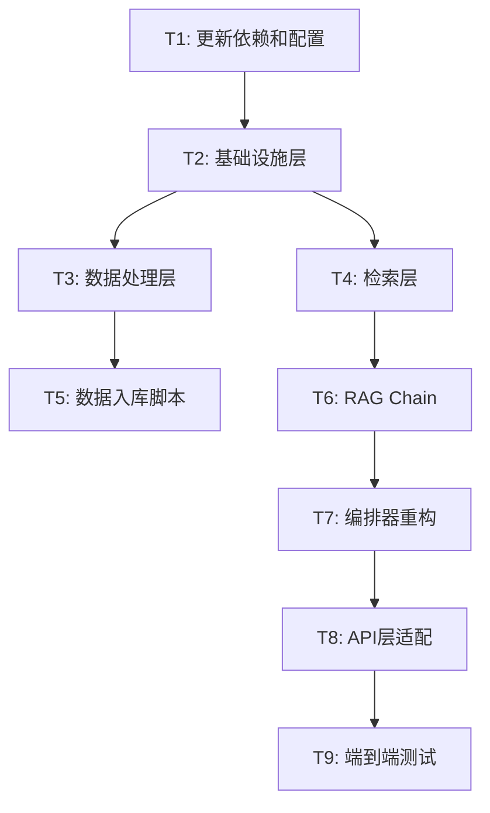

# TASK - LangChain重构原子任务

## 任务依赖图

## T1: 更新依赖和配置
- **输入**: 现有requirements.txt、config.py、.env.example
- **输出**: 更新后的依赖文件和配置
- **实现**:
  - 更新requirements.txt：添加langchain、langchain-core、langchain-community、langchain-chroma、langchain-text-splitters
  - 更新config.py：添加LangChain相关配置项
  - 更新.env.example
- **验收**: pip install成功，配置加载正常

## T2: 基础设施层
- **输入**: LangChain包、DashScope API Key
- **输出**: app/infrastructure/ 模块
- **实现**:
  - llm.py: ChatTongyi工厂函数
  - embeddings.py: DashScopeEmbeddings工厂函数
  - vectorstore.py: Chroma VectorStore工厂函数
- **验收**: 各工厂函数可正确创建实例

## T3: 数据处理层
- **输入**: 现有chunker.py、markdown_parser.py、excel_parser.py
- **输出**: 适配LangChain Document格式的数据处理模块
- **实现**:
  - document_loaders.py: Markdown/Excel → LangChain Document加载器
  - chunker.py: 保留表格检测，输出LangChain Document列表
- **验收**: 解析Markdown/Excel后输出List[Document]

## T4: 检索层
- **输入**: LangChain检索器组件、ChromaDB数据
- **输出**: app/retrievers/ 模块
- **实现**:
  - chroma_retriever.py: 基于Chroma VectorStore的检索器
  - bm25_retriever.py: 基于LangChain BM25Retriever
  - web_retriever.py: 基于TavilySearchResults
  - ensemble_retriever.py: 基于EnsembleRetriever
  - reranker.py: 自定义重排序（本地优先）
- **验收**: 各检索器可独立检索并返回结果

## T5: 数据入库脚本
- **输入**: data/processed/目录下的文档
- **输出**: ChromaDB向量数据 + BM25索引
- **实现**:
  - 重构ingest.py：使用LangChain组件
  - Document加载 → 切片 → Embedding → 入库ChromaDB
  - 同时构建BM25索引
- **验收**: 入库成功，可检索

## T6: RAG Chain
- **输入**: 检索器、LLM、Prompt模板
- **输出**: app/chains/ 模块
- **实现**:
  - prompts.py: 系统Prompt + 问答Prompt
  - rag_chain.py: LCEL RAG Chain（同步+流式）
- **验收**: Chain可正常调用并返回答案

## T7: 编排器重构
- **输入**: RAG Chain、检索器、缓存
- **输出**: app/core/orchestrator.py
- **实现**:
  - 整合缓存、检索、Chain
  - 处理网络检索补充逻辑
  - 来源信息提取
- **验收**: 编排器可端到端处理查询

## T8: API层适配
- **输入**: 编排器、FastAPI
- **输出**: 更新后的API路由
- **实现**:
  - query.py: 同步+流式接口适配
  - source.py: 来源追溯适配
  - health.py: 健康检查适配
  - main.py: 启动逻辑更新
- **验收**: API接口可正常调用

## T9: 端到端测试
- **输入**: 完整系统
- **输出**: 测试报告
- **实现**:
  - 数据入库
  - 启动服务
  - 运行测试脚本
  - 验证各功能
- **验收**: 所有功能正常
