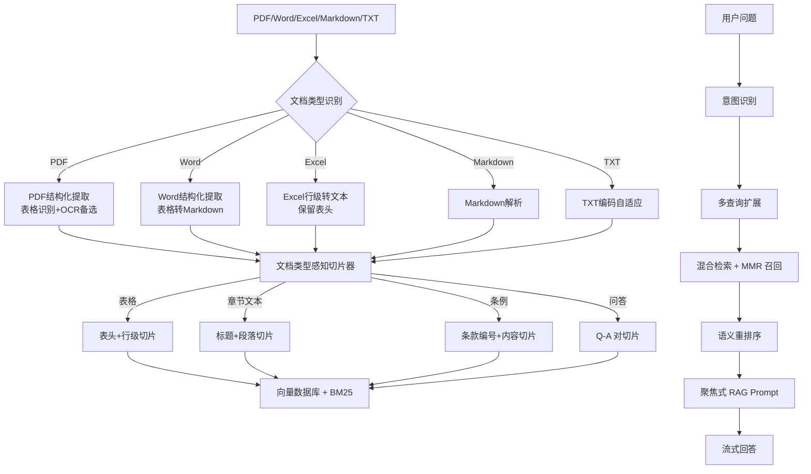

# RAG 效果优化设计文档

## 1. 问题诊断

### 1.1 现象

用户提问："客户经理被投诉一次扣几分"

系统回答：列出整张扣分标准表（1分/2分/4分/10分），未聚焦到"一般投诉扣2分"这一具体答案。

### 1.2 根因

| 环节 | 问题 | 影响 |
|------|------|------|
| 文档提取 | PDF 使用 pypdf 纯文本提取，行被截断、表格结构被破坏 | 条例项跨行内容无法合并，表格行与表头分离 |
| 文档提取 | Word 表格每行转成 `"\|"` 分隔文本，缺少表头上下文 | 行级嵌入无法对应"投诉类型-扣分"关系 |
| 切片策略 | `HEADER_PATTERN` 错误匹配数字编号列表项（如 `1、...`） | 条例项被当作标题，短内容被丢弃，最终只保留大段落 |
| 切片策略 | 条例项（第X条、X、（X））未独立切片 | 同一条规则被合并到大段落中，检索无法精确召回 |
| 切片策略 | 仅识别 Markdown 表格，PDF/Word 表格识别失败 | 表格与普通段落混在一起 |
| 切片策略 | 缺少章节/标题上下文增强 | 检索片段无法判断规则适用范围 |
| 查询重写 | 词表为公路工程质检专用，与银行考核文档无关 | 问题未对齐到表格列标题/条例描述 |
| 检索召回 | top_k 偏小，BM25 索引未自动加载 | 混合检索退化为纯向量检索 |
| 重排序 | 未对条例项（article）和查询核心词加权 | 相似但无关的条例被排在真实相关条例前面 |
| Prompt | 要求"完整提取表格所有行" | 模型过度罗列，未聚焦最相关条目 |

## 2. 优化目标

1. 提升表格类文档的提取与切片质量，保持"行-表头"关系
2. 按文档类型/内容格式采用不同切片策略
3. 优化检索召回与重排序，确保问题相关片段进入上下文
4. 优化 Prompt，使回答聚焦用户问题最相关条目
5. 补充单元测试，覆盖新策略

## 3. 架构设计

## 4. 核心策略

### 4.1 文档类型感知切片

| 文档类型/格式 | 切片策略 | 关键设计 |
|---------------|---------|----------|
| Markdown | 按标题层级切分，保留标题上下文；表格按行切片 | `#` 二级标题作为段落前缀；表格行携带表头 |
| PDF | PyMuPDF 提取文本+表格；表格按"表头+行"切片；条例项（第X条、X、（X））每条独立切片 | 保留 `[第N页]` 标记；pypdf 作为回退 |
| Word | 解析段落和表格；表格转为 Markdown 格式后按行切片；条例项独立切片 | 每行携带表头 |
| Excel | 每行转"列名:值"文本；整表表头作为上下文 | 行级独立 Document |
| TXT | 按章节/段落切分；检测数字编号条款；条例项独立切片 | 保留前后文标题 |

### 4.2 表格类片段增强

- 每个表格行生成独立片段，前缀为表头
- 片段元数据标记 `is_table_row=True`、`table_caption`、`table_header`
- 表格片段加入BM25关键词，提升精确匹配

### 4.3 检索优化

- 召回数量从 `top_k` 提升到 `top_k * 5`
- 引入 MMR（最大边际相关性）去重，保证多样性
- 多查询扩展：对原问题生成 2-4 个语义等价查询，合并召回结果
- 表格式片段与条例项（`chunk_type=article`）在重排序中加权
- 重排序增加查询核心实体词匹配和强信号词匹配（如"投诉"），帮助区分相似条例
- Orchestrator 启动时自动加载 BM25 索引，确保混合检索生效

### 4.4 Prompt 优化

- 移除"公路工程专家"固定角色，改为"基于参考资料的专业助手"
- 增加"聚焦最相关条目"指令
- 要求"如果表格/条例中有多条，先给出与问题最匹配的一条的答案，再简要列出其他可能情况"
- 强制"直接给数值"：用户问"扣几分"时，第一句必须是数值答案
- 强制标注来源：文档名、页码/章节

## 5. 任务拆分

1. 重构 `TextChunker`，实现文档类型感知切片（含条例项独立切片）
2. 增强 PDF/Word/Excel 提取器，保留表格结构（PDF 改用 PyMuPDF）
3. 优化 `QueryRewriter`，支持通用领域 + 表格/条例关键词
4. 优化 `ensemble_retriever`，引入 MMR 与多查询扩展，增大召回
5. 优化 `Reranker`，对 table_row/article 和查询核心词/强信号词加权
6. 优化 `Prompt`，聚焦回答、直接给数值
7. 优化 `QueryOrchestrator`，自动加载 BM25 索引
8. 补充单元测试
9. 重建知识库并验证

## 6. 验收标准

- [x] 上传同一份 PDF 后，切片数合理，条例项独立切片且不丢失
- [x] 提问"客户经理被投诉一次扣几分"，首句直接回答"扣2分"
- [x] 提问"客户服务效率低被投诉一次扣多少分"，首句直接回答"扣2分"
- [x] 提问长描述"浦发上海浦东发展银行西安分行个金客户经理被投诉扣几分"，首句直接回答"扣2分"并引用正确条例
- [x] 单元测试覆盖率提升，新增测试全部通过
- [x] 原公路工程文档问答能力不回归
- [x] 修复语义重排序 `AccessDenied` 问题：新增 `USE_SEMANTIC_RERANK` 配置，默认关闭，避免 API Key 不支持 `gte-rerank` 时反复报错
- [x] 重建知识库，清除旧切片中错误的页码等脏元数据，确保来源引用准确

## 7. 最终验证结果

验证结果（通过 `python3 test_api.py` 或前端页面测试）：

| 问题 | 首句答案 | 来源引用 |
|------|---------|---------|
| 客户经理被投诉一次扣几分 | - 2分 | （一）服务质量考核 第2条 |
| 客户服务效率低被投诉一次扣多少分 | - 2分 | （一）服务质量考核 第2条 |
| 浦发上海浦东发展银行西安分行个金客户经理被投诉扣几分 | 2分 | （一）服务质量考核 |

执行 `python3 -m pytest tests/ -q`：52 个单元测试全部通过。
