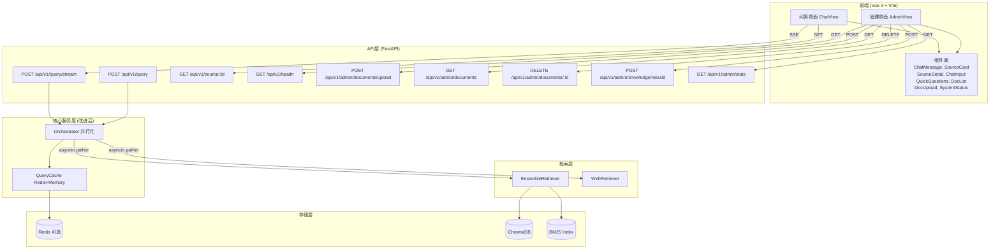

# DESIGN - 前端界面与后端优化

## 一、整体架构图



## 二、各层设计详情

### 2.1 前端设计

#### 2.1.1 路由设计

| 路径 | 组件 | 描述 |
|------|------|------|
| `/` | ChatView | 问答交互界面（默认） |
| `/admin` | AdminView | 管理员界面 |

#### 2.1.2 组件树

```
App.vue
├── el-container (布局容器)
│   ├── el-header
│   │   └── NavBar (Logo + 标题 + 路由链接)
│   └── el-main
│       └── router-view
│           ├── ChatView.vue (/)
│           │   ├── el-scrollbar (对话区域)
│           │   │   └── ChatMessage.vue × N
│           │   │       └── SourceCard.vue × N
│           │   │           └── SourceDetail.vue (弹窗)
│           │   ├── QuickQuestions.vue
│           │   └── ChatInput.vue
│           │       ├── el-switch (网络检索开关)
│           │       └── el-input + el-button
│           └── AdminView.vue (/admin)
│               ├── el-menu (侧边栏)
│               │   ├── 文档管理
│               │   └── 系统状态
│               ├── DocList.vue
│               │   └── el-table (文档列表)
│               ├── DocUpload.vue
│               │   └── el-upload (拖拽上传)
│               └── SystemStatus.vue
│                   └── el-descriptions (状态面板)
```

#### 2.1.3 数据流

```
ChatView:
  question → ChatInput.emit('send')
    → SSE /api/v1/query/stream
    → onMessage: append text to ChatMessage.answer
    → onDone: show SourceCard list, query_time_ms

AdminView:
  upload → DocUpload → POST /api/v1/admin/documents/upload
    → refresh DocList → GET /api/v1/admin/documents
  delete → DocList → DELETE /api/v1/admin/documents/{id}
    → refresh DocList
  rebuild → POST /api/v1/admin/knowledge/rebuild
    → show progress → refresh SystemStatus
```

#### 2.1.4 SSE流式处理

```javascript
// api/index.js - 流式问答核心逻辑
async function* streamQuery(question, options) {
  const response = await fetch('/api/v1/query/stream', {
    method: 'POST',
    headers: { 'Content-Type': 'application/json' },
    body: JSON.stringify({ question, options })
  });
  
  const reader = response.body.getReader();
  const decoder = new TextDecoder();
  let buffer = '';
  
  while (true) {
    const { done, value } = await reader.read();
    if (done) break;
    buffer += decoder.decode(value, { stream: true });
    
    // 解析SSE事件
    const lines = buffer.split('\n');
    buffer = lines.pop() || '';
    
    for (const line of lines) {
      if (line.startsWith('data: ')) {
        const data = JSON.parse(line.slice(6));
        if (data.type === 'answer') yield { type: 'answer', content: data.content };
        if (data.sources) yield { type: 'done', sources: data.sources, query_time_ms: data.query_time_ms, used_web_search: data.used_web_search };
      }
    }
  }
}
```

### 2.2 后端管理API设计

#### 2.2.1 文档上传接口

```python
# app/api/routes/admin.py

@router.post("/documents/upload")
async def upload_document(
    file: UploadFile = File(...),
):
    """
    上传文档并自动入库
    
    1. 保存文件到 data/processed/
    2. 调用 ingest_pipeline 处理单个文件
    3. 更新 ChromaDB 和 BM25 索引
    """
    pass

@router.get("/documents")
async def list_documents():
    """
    获取已入库文档列表
    从ChromaDB metadata聚合统计
    """
    pass

@router.delete("/documents/{doc_id}")
async def delete_document(doc_id: str):
    """
    删除文档及其所有切片
    1. ChromaDB: collection.delete(where={"doc_id": doc_id})
    2. BM25: 需要重建索引（简化方案）
    """
    pass

@router.post("/knowledge/rebuild")
async def rebuild_knowledge():
    """
    全量重建知识库
    调用 scripts/ingest.py 的完整流水线
    """
    pass

@router.get("/stats")
async def get_stats():
    """
    获取知识库详细统计
    返回: 文档数、切片数、各文档切片分布
    """
    pass
```

### 2.3 检索并行化设计

```python
# orchestrator.py - process_query 改进
import asyncio

async def process_query(self, question, use_web_search=True, top_k=5, use_cache=True):
    # 查询重写
    rewritten_query = self._rewrite(question)
    
    # 并行执行：本地检索 + 网络检索
    local_task = asyncio.create_task(self._hybrid_retrieve_async(rewritten_query, top_k * 2))
    web_task = asyncio.create_task(self._search_web_async(question, top_k)) if use_web_search else None
    
    if web_task:
        local_results, web_results = await asyncio.gather(local_task, web_task)
    else:
        local_results = await local_task
        web_results = []
    
    # 重排序 + RAG生成（不变）
    ...
```

**关键变化：**
- `process_query` 改为 `async def`
- `hybrid_retrieve` 和 `search_web` 通过 `asyncio.gather` 并行
- 原先串行时间 ≈ T(local) + T(web)，并行后 ≈ max(T(local), T(web))

### 2.4 Redis缓存设计

```python
# utils/cache.py - 新增 RedisCacheBackend

class CacheBackend(ABC):
    @abstractmethod
    def get(self, key: str) -> Optional[Dict]: ...
    @abstractmethod
    def set(self, key: str, data: Dict, ttl: int): ...
    @abstractmethod
    def delete(self, key: str): ...
    @abstractmethod
    def clear(self): ...

class MemoryCacheBackend(CacheBackend):
    # 现有内存缓存逻辑
    ...

class RedisCacheBackend(CacheBackend):
    def __init__(self, redis_url: str):
        self.redis = redis.from_url(redis_url)
    
    def get(self, key: str) -> Optional[Dict]:
        data = self.redis.get(key)
        return json.loads(data) if data else None
    
    def set(self, key: str, data: Dict, ttl: int):
        self.redis.setex(key, ttl, json.dumps(data, ensure_ascii=False))
    ...

class QueryCache:
    def __init__(self, redis_url: Optional[str] = None, ...):
        if redis_url:
            try:
                self.backend = RedisCacheBackend(redis_url)
            except Exception:
                logger.warning("Redis连接失败，降级为内存缓存")
                self.backend = MemoryCacheBackend(...)
        else:
            self.backend = MemoryCacheBackend(...)
    
    def get(self, question, use_web_search=False):
        key = self._generate_key(question, use_web_search)
        return self.backend.get(key)
    
    def set(self, question, data, use_web_search=False):
        key = self._generate_key(question, use_web_search)
        self.backend.set(key, data, self.ttl_seconds)
```

### 2.5 类型注解设计

```python
# infrastructure/llm.py - 改进前后对比

# 改进前
from typing import Optional
def get_llm() -> object:
    ...

# 改进后
from typing import Optional, TYPE_CHECKING
if TYPE_CHECKING:
    from langchain_community.chat_models import ChatTongyi

def get_llm() -> "ChatTongyi":
    ...

# 同理应用于:
# infrastructure/embeddings.py → "DashScopeEmbeddings"
# infrastructure/vectorstore.py → "Chroma"  
# retrievers/bm25_retriever.py → "BM25Retriever"
# retrievers/chroma_retriever.py → "VectorStoreRetriever"
# retrievers/web_retriever.py → "TavilySearchResults"
# retrievers/ensemble_retriever.py → "EnsembleRetriever"
# chains/rag_chain.py → "Runnable"
```

### 2.6 单元测试设计

```python
# tests/test_chunker.py
class TestTextChunker:
    def test_split_markdown_with_tables(self): ...
    def test_split_large_table(self): ...
    def test_split_empty_document(self): ...
    def test_split_single_paragraph(self): ...
    def test_chunk_size_limit(self): ...

# tests/test_query_rewriter.py
class TestQueryRewriter:
    def test_rule_based_rewrite_colloquial(self): ...
    def test_rule_based_rewrite_no_change(self): ...
    def test_term_mapping(self): ...
    def test_sentence_normalization(self): ...
    def test_empty_query(self): ...

# tests/test_reranker.py
class TestReranker:
    def test_fallback_rerank_local_priority(self): ...
    def test_fallback_rerank_empty_input(self): ...
    def test_fallback_rerank_mixed_sources(self): ...

# tests/test_cache.py
class TestQueryCache:
    def test_cache_hit(self): ...
    def test_cache_miss(self): ...
    def test_cache_expiry(self): ...
    def test_cache_eviction(self): ...
    def test_cache_key_generation(self): ...

# tests/test_document_loaders.py
class TestMarkdownLoader:
    def test_load_markdown(self): ...
    def test_load_empty_file(self): ...

class TestExcelLoader:
    def test_load_xlsx(self): ...
    def test_load_empty_excel(self): ...
```

## 三、配置变更

### config.py 新增

```python
# Redis配置（可选）
REDIS_URL: Optional[str] = Field(
    default=None,
    description="Redis连接URL，不配置则使用内存缓存"
)
REDIS_CACHE_TTL: int = Field(default=3600, description="Redis缓存过期时间(秒)")
```

### .env.example 新增

```env
# Redis配置（可选，不配置则使用内存缓存）
# REDIS_URL=redis://localhost:6379/0
# REDIS_CACHE_TTL=3600
```

### requirements.txt 新增

```
# redis缓存
redis>=5.0.0

# 测试
pytest>=8.0.0
pytest-asyncio>=0.23.0
pytest-cov>=4.1.0
```

### docker-compose.yml 新增

```yaml
  redis:
    image: redis:7-alpine
    container_name: rag-redis
    ports:
      - "6379:6379"
    volumes:
      - ./data/redis:/data
    profiles:
      - with-redis  # 可选profile，默认不启动
```
