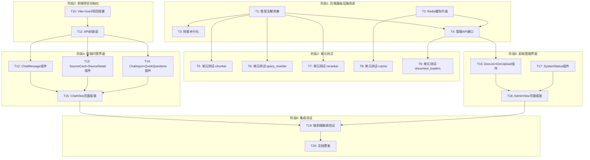

# TASK - 前端界面与后端优化

## 一、任务依赖关系图



## 二、原子任务详细定义

---

### T1 - 类型注解完善

**状态**：待开始

**输入契约：**
- 现有 app/infrastructure/, app/retrievers/, app/chains/, app/core/ 源码

**输出契约：**
- 所有工厂函数返回类型从 `-> object` 改为具体类型（使用 `TYPE_CHECKING`）
- 所有函数参数添加完整类型注解
- 0个 `-> object` 残留

**涉及文件：**
| 文件 | 改动 |
|------|------|
| [app/infrastructure/llm.py](file:///Users/jinmu/Desktop/金木/my-project/工程质检RAG系统/app/infrastructure/llm.py) | `get_llm() -> "ChatTongyi"` |
| [app/infrastructure/embeddings.py](file:///Users/jinmu/Desktop/金木/my-project/工程质检RAG系统/app/infrastructure/embeddings.py) | `get_embeddings() -> "DashScopeEmbeddings"` |
| [app/infrastructure/vectorstore.py](file:///Users/jinmu/Desktop/金木/my-project/工程质检RAG系统/app/infrastructure/vectorstore.py) | `get_vectorstore() -> "Chroma"` |
| [app/retrievers/chroma_retriever.py](file:///Users/jinmu/Desktop/金木/my-project/工程质检RAG系统/app/retrievers/chroma_retriever.py) | `get_chroma_retriever() -> "VectorStoreRetriever"` |
| [app/retrievers/bm25_retriever.py](file:///Users/jinmu/Desktop/金木/my-project/工程质检RAG系统/app/retrievers/bm25_retriever.py) | `get_bm25_retriever() -> Optional["BM25Retriever"]` |
| [app/retrievers/ensemble_retriever.py](file:///Users/jinmu/Desktop/金木/my-project/工程质检RAG系统/app/retrievers/ensemble_retriever.py) | `get_ensemble_retriever() -> "EnsembleRetriever"` |
| [app/retrievers/web_retriever.py](file:///Users/jinmu/Desktop/金木/my-project/工程质检RAG系统/app/retrievers/web_retriever.py) | `get_web_retriever() -> "TavilySearchResults"` |
| [app/chains/rag_chain.py](file:///Users/jinmu/Desktop/金木/my-project/工程质检RAG系统/app/chains/rag_chain.py) | `get_rag_chain() -> "Runnable"` |

**验收标准：**
- [ ] `grep -r "\-> object" app/` 输出为空
- [ ] `grep -r "Optional\[object\]" app/` 输出为空
- [ ] 服务启动成功无警告

**依赖：** 无

---

### T2 - Redis缓存升级

**状态**：待开始

**输入契约：**
- 现有 [app/utils/cache.py](file:///Users/jinmu/Desktop/金木/my-project/工程质检RAG系统/app/utils/cache.py)
- 现有 [app/config.py](file:///Users/jinmu/Desktop/金木/my-project/工程质检RAG系统/app/config.py)

**输出契约：**
- `cache.py` 重构为后端抽象模式（`CacheBackend` → `MemoryCacheBackend` / `RedisCacheBackend`）
- `QueryCache` 根据 `REDIS_URL` 自动选择后端
- Redis不可用时日志警告并降级内存
- `config.py` 新增 `REDIS_URL`, `REDIS_CACHE_TTL` 配置项
- `.env.example` 新增Redis配置注释
- `requirements.txt` 添加 `redis>=5.0.0`

**验收标准：**
- [ ] 不配REDIS_URL：使用内存缓存，行为不变
- [ ] 配置正确REDIS_URL：使用Redis缓存
- [ ] 配置错误REDIS_URL：日志警告 + 降级内存
- [ ] 缓存读写正确（key为MD5哈希）
- [ ] docker-compose.yml 添加可选redis服务

**依赖：** 无

---

### T3 - 检索并行化

**状态**：待开始

**输入契约：**
- 现有 [app/core/orchestrator.py](file:///Users/jinmu/Desktop/金木/my-project/工程质检RAG系统/app/core/orchestrator.py)

**输出契约：**
- `process_query()` 改为 `async def`，使用 `asyncio.gather` 并行本地+网络检索
- `process_query_stream()` 同理并行化
- 新增 `_hybrid_retrieve_async()` 和 `_search_web_async()` 辅助方法

**验收标准：**
- [ ] 本地检索和网络检索并行执行
- [ ] 异常处理：网络检索失败不影响本地结果
- [ ] 串行/并行结果一致性验证
- [ ] query路由调用处适配 async

**依赖：** T1（类型注解）

---

### T4 - 管理API接口

**状态**：待开始

**输入契约：**
- 现有 document_loaders, chunker, vectorstore, bm25_retriever
- 现有 [app/models/response.py](file:///Users/jinmu/Desktop/金木/my-project/工程质检RAG系统/app/models/response.py)

**输出契约：**
- 新增 [app/api/routes/admin.py](file:///Users/jinmu/Desktop/金木/my-project/工程质检RAG系统/app/api/routes/admin.py) 包含5个接口：
  - `POST /documents/upload` - 文件上传+入库
  - `GET /documents` - 文档列表（聚合metadata）
  - `DELETE /documents/{doc_id}` - 删除文档+切片
  - `POST /knowledge/rebuild` - 全量重建
  - `GET /stats` - 知识库统计
- `main.py` 注册admin路由

**验收标准：**
- [ ] 上传MD/XLS文件成功入库
- [ ] 文档列表正确显示doc_name、切片数
- [ ] 删除文档后ChromaDB中对应记录清除
- [ ] 重建知识库功能可触发
- [ ] 统计接口返回正确数据

**依赖：** T1（类型注解）

---

### T5 - 单元测试：chunker

**状态**：待开始

**输入契约：**
- 现有 [app/processors/chunker.py](file:///Users/jinmu/Desktop/金木/my-project/工程质检RAG系统/app/processors/chunker.py)

**输出契约：**
- 新增 `tests/test_chunker.py`
- 测试用例：
  - `test_split_markdown_with_tables` - 表格检测和保留
  - `test_split_large_table` - 大表格按行切分
  - `test_split_empty_document` - 空文档处理
  - `test_split_single_paragraph` - 单段落切分
  - `test_chunk_size_limit` - 切片大小限制
  - `test_table_extraction` - 表格提取函数
  - `test_chunk_id_generation` - ID生成唯一性

**验收标准：**
- [ ] `pytest tests/test_chunker.py -v` 全部通过
- [ ] 覆盖率 > 80%

**依赖：** T1（类型注解）

---

### T6 - 单元测试：query_rewriter

**状态**：待开始

**输入契约：**
- 现有 [app/processors/query_rewriter.py](file:///Users/jinmu/Desktop/金木/my-project/工程质检RAG系统/app/processors/query_rewriter.py)

**输出契约：**
- 新增 `tests/test_query_rewriter.py`
- 测试用例：
  - `test_rule_based_rewrite_colloquial` - 口语化→规范
  - `test_rule_based_rewrite_no_change` - 无需重写
  - `test_term_mapping` - 术语映射正确性
  - `test_sentence_normalization` - 句式规范化
  - `test_empty_query` - 空查询
  - `test_filler_word_removal` - 修饰词移除

**验收标准：**
- [ ] `pytest tests/test_query_rewriter.py -v` 全部通过
- [ ] 覆盖率 > 85%

**依赖：** T1（类型注解）

---

### T7 - 单元测试：reranker

**状态**：待开始

**输入契约：**
- 现有 [app/retrievers/reranker.py](file:///Users/jinmu/Desktop/金木/my-project/工程质检RAG系统/app/retrievers/reranker.py)

**输出契约：**
- 新增 `tests/test_reranker.py`
- 测试用例：
  - `test_fallback_rerank_local_priority` - 本地优先排序
  - `test_fallback_rerank_empty_input` - 空输入
  - `test_fallback_rerank_mixed_sources` - 混合来源排序
  - `test_fallback_rerank_top_k_limit` - 结果数量限制

**验收标准：**
- [ ] `pytest tests/test_reranker.py -v` 全部通过
- [ ] 覆盖率 > 80%

**依赖：** T1（类型注解）

---

### T8 - 单元测试：cache

**状态**：待开始

**输入契约：**
- 现有 [app/utils/cache.py](file:///Users/jinmu/Desktop/金木/my-project/工程质检RAG系统/app/utils/cache.py)（T2改进后）

**输出契约：**
- 新增 `tests/test_cache.py`
- 测试用例：
  - `test_cache_hit` - 缓存命中
  - `test_cache_miss` - 缓存未命中
  - `test_cache_expiry` - 过期清理
  - `test_cache_eviction` - 容量淘汰
  - `test_cache_key_generation` - Key生成确定性
  - `test_cache_clear` - 清空功能
  - `test_cache_web_search_key_diff` - 网络检索Key区分

**验收标准：**
- [ ] `pytest tests/test_cache.py -v` 全部通过
- [ ] 覆盖率 > 85%

**依赖：** T2（Redis缓存）

---

### T9 - 单元测试：document_loaders

**状态**：待开始

**输入契约：**
- 现有 [app/processors/document_loaders.py](file:///Users/jinmu/Desktop/金木/my-project/工程质检RAG系统/app/processors/document_loaders.py)

**输出契约：**
- 新增 `tests/test_document_loaders.py`
- 使用 `tmp_path` fixture创建临时测试文件
- 测试用例：
  - `test_load_markdown` - MD文件加载
  - `test_load_empty_markdown` - 空MD
  - `test_load_xlsx` - XLSX加载
  - `test_load_xls` - XLS加载
  - `test_load_empty_excel` - 空Excel
  - `test_metadata_generation` - metadata正确性

**验收标准：**
- [ ] `pytest tests/test_document_loaders.py -v` 全部通过
- [ ] 覆盖率 > 80%

**依赖：** T1（类型注解）

---

### T10 - Vite+Vue3项目搭建

**状态**：待开始

**输入契约：**
- 前端需求文档 + CONSENSUS技术选型

**输出契约：**
- `frontend/` 目录完整项目骨架
- `package.json` 含所有依赖
- `vite.config.js` 含API代理配置（`/api/v1` → `localhost:5002`）
- `index.html` 入口
- `src/main.js`, `src/App.vue` 根组件
- `src/router/index.js` 路由（`/` → ChatView, `/admin` → AdminView）
- Element Plus完整引入

**验收标准：**
- [ ] `npm install` 无错误
- [ ] `npm run dev` 成功启动，访问正常
- [ ] Vite proxy正确代理API请求

**依赖：** 无

---

### T11 - API封装层

**状态**：待开始

**输入契约：**
- T10项目骨架

**输出契约：**
- `src/api/index.js`
  - `streamQuery(question, options)` - SSE流式问答（AsyncGenerator）
  - `getSourceDetail(chunkId)` - 来源详情
  - `getHealth()` - 健康检查
  - `uploadDocument(file)` - 上传文档
  - `getDocuments()` - 文档列表
  - `deleteDocument(docId)` - 删除文档
  - `rebuildKnowledge()` - 重建知识库
  - `getStats()` - 知识库统计

**验收标准：**
- [ ] 所有API函数可正常调用
- [ ] 流式问答正确解析SSE事件
- [ ] 错误处理完善

**依赖：** T10

---

### T12 - ChatMessage组件

**状态**：待开始

**输入契约：**
- T10项目骨架 + T11 API

**输出契约：**
- `src/components/ChatMessage.vue`
  - Props: `role`(user/assistant), `content`, `sources`, `queryTimeMs`, `isStreaming`
  - 用户消息：右对齐，蓝色气泡
  - 系统消息：左对齐，白色气泡，Markdown渲染
  - 流式渲染时逐字显示（`isStreaming=true`）
  - 响应时间显示

**验收标准：**
- [ ] 用户/系统消息样式正确区分
- [ ] Markdown内容正确渲染（表格、列表、加粗）
- [ ] 流式模式字符逐字追加
- [ ] 时间格式化显示

**依赖：** T11

---

### T13 - SourceCard + SourceDetail组件

**状态**：待开始

**输入契约：**
- T10项目骨架 + T11 API

**输出契约：**
- `src/components/SourceCard.vue`
  - 来源类型标签（绿色"规范文档" / 橙色"网络来源"）
  - 文档名、页码、章节
  - 「查看原文」按钮
- `src/components/SourceDetail.vue`
  - el-dialog弹窗
  - 显示完整原文、前后文上下文
  - 「复制内容」按钮（clipboard API）
  - 通过 `getSourceDetail(chunkId)` API获取数据

**验收标准：**
- [ ] 来源卡片正确显示标签颜色
- [ ] 点击查看原文弹窗正确
- [ ] 弹窗loading状态
- [ ] 复制功能可用

**依赖：** T11

---

### T14 - ChatInput + QuickQuestions组件

**状态**：待开始

**输入契约：**
- T10项目骨架

**输出契约：**
- `src/components/ChatInput.vue`
  - el-input（textarea模式，3行）
  - 发送按钮（空内容时禁用）
  - 网络检索el-switch开关
  - Enter发送，Shift+Enter换行
  - 发送后清空+loading状态
- `src/components/QuickQuestions.vue`
  - 预设快捷问题列表
  - 点击自动填入输入框

**验收标准：**
- [ ] 空输入时发送按钮禁用
- [ ] Enter发送，Shift+Enter换行
- [ ] 发送后输入框清空
- [ ] 快捷问题点击生效
- [ ] 网络检索开关label正确

**依赖：** T10

---

### T15 - ChatView页面组装

**状态**：待开始

**输入契约：**
- T12, T13, T14组件 + T11 API

**输出契约：**
- `src/views/ChatView.vue`
  - 对话区域：el-scrollbar内消息列表
  - 欢迎状态：无对话历史时显示Logo+引导语
  - 消息列表：ChatMessage × N
  - 发送流程：用户消息 → loading → SSE流式 → 来源展示
  - 自动滚动到底部
  - 来源卡片：SourceCard列表
  - 来源弹窗：SourceDetail
  - 输入区域：ChatInput + QuickQuestions

**验收标准：**
- [ ] 欢迎状态正确
- [ ] 发送问题 → 流式显示答案
- [ ] 来源卡片正确展示
- [ ] 查看原文弹窗可用
- [ ] 响应式布局（桌面/平板/移动端）
- [ ] 网络错误友好提示

**依赖：** T12, T13, T14

---

### T16 - DocList + DocUpload组件

**状态**：待开始

**输入契约：**
- T10项目骨架 + T11 API

**输出契约：**
- `src/components/DocList.vue`
  - el-table显示：文档名、类型、切片数、上传时间
  - 操作列：删除按钮（带确认弹窗）
  - 空状态提示
- `src/components/DocUpload.vue`
  - el-upload组件（拖拽+点击）
  - 接受 .md, .xls, .xlsx
  - 上传成功自动刷新列表
  - 上传进度提示

**验收标准：**
- [ ] 文档列表正确显示
- [ ] 删除确认弹窗
- [ ] 拖拽上传功能
- [ ] 上传格式限制
- [ ] 上传后列表自动刷新

**依赖：** T11

---

### T17 - SystemStatus组件

**状态**：待开始

**输入契约：**
- T10项目骨架 + T11 API

**输出契约：**
- `src/components/SystemStatus.vue`
  - el-descriptions显示：
    - 系统状态（healthy/degraded）
    - 向量数据库状态
    - LLM状态
    - Embedding状态
    - 总切片数 / 总文档数
  - 「重建知识库」按钮 + 确认弹窗
  - 状态自动刷新（30s间隔）

**验收标准：**
- [ ] 状态正确显示（绿色/红色）
- [ ] 重建知识库按钮可用
- [ ] 自动刷新功能

**依赖：** T11

---

### T18 - AdminView页面组装

**状态**：待开始

**输入契约：**
- T16, T17组件 + T11 API

**输出契约：**
- `src/views/AdminView.vue`
  - el-container布局（侧边栏+内容）
  - 侧边栏：文档管理 / 系统状态 菜单切换
  - 内容区：根据菜单显示 DocList+DocUpload 或 SystemStatus

**验收标准：**
- [ ] 侧边栏切换正常
- [ ] 文档管理页面完整
- [ ] 系统状态页面完整
- [ ] 响应式布局

**依赖：** T16, T17

---

### T19 - 端到端联调验证

**状态**：待开始

**输入契约：**
- 后端服务运行中（含T1-T4改进）
- 前端开发服务器运行中

**输出契约：**
- 完成完整用户流程测试
- 记录并修复联调中发现的问题

**验收标准：**
- [ ] 问答流程：输入问题 → 流式回答 → 来源展示 → 查看原文
- [ ] 管理流程：上传文档 → 列表可见 → 删除文档 → 列表更新
- [ ] 健康检查：前端状态面板数据正确
- [ ] 错误场景：后端断开 → 前端友好提示
- [ ] 跨域正常：CORS无报错

**依赖：** T15, T18

---

### T20 - 文档更新

**状态**：待开始

**输入契约：**
- 所有代码变更完成

**输出契约：**
- `README.md` 更新前端相关说明
- `.env.example` 更新
- `docs/前端与后端优化/ACCEPTANCE_前端与后端优化.md` 验收文档
- `docs/前端与后端优化/TODO_前端与后端优化.md` 待办文档
- 更新 `requirements.txt`

**验收标准：**
- [ ] README添加前端启动说明
- [ ] 验收文档覆盖所有验收标准
- [ ] TODO列出后续改进项

**依赖：** T19

---

## 三、执行顺序建议

```
第1轮（并行）: T1, T2, T10
第2轮（并行）: T3, T4, T11
第3轮（并行）: T5, T6, T7, T8, T9, T12, T13, T14
第4轮（并行）: T15, T16, T17
第5轮（并行）: T18
第6轮（串行）: T19 → T20
```
