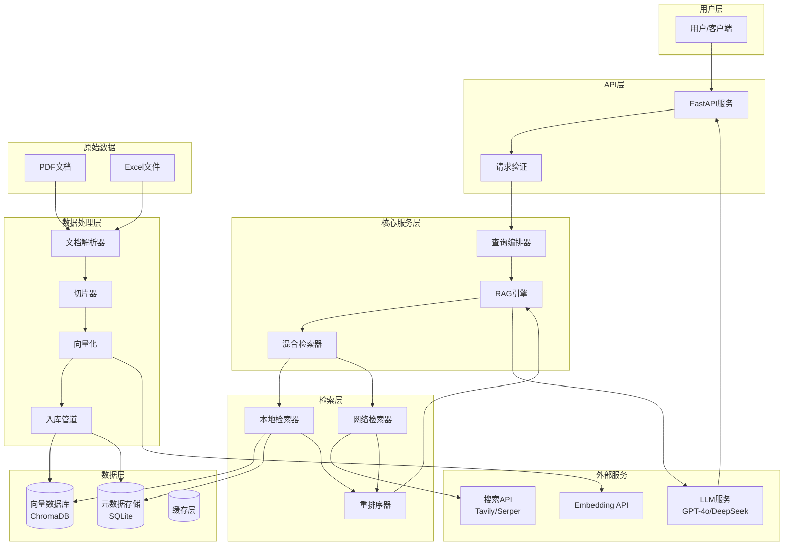
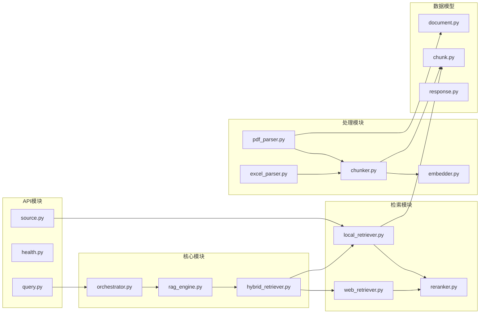
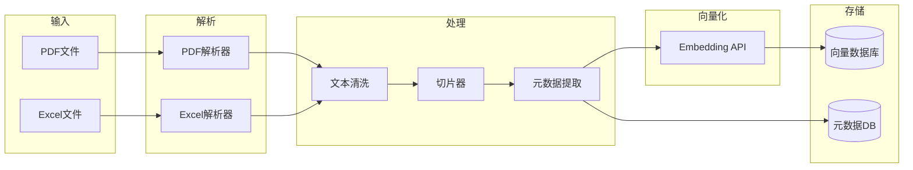
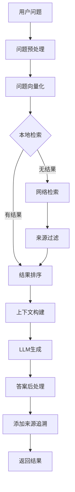

# DESIGN - 工程质检RAG系统

## 一、整体架构图



## 二、分层设计

### 2.1 目录结构

```
工程质检RAG系统/
├── app/
│   ├── __init__.py
│   ├── main.py                 # FastAPI入口
│   ├── config.py               # 配置管理
│   ├── api/
│   │   ├── __init__.py
│   │   ├── routes/
│   │   │   ├── query.py        # 问答接口
│   │   │   ├── health.py       # 健康检查
│   │   │   └── source.py       # 来源追溯
│   │   └── deps.py             # 依赖注入
│   ├── core/
│   │   ├── __init__.py
│   │   ├── orchestrator.py     # 查询编排器
│   │   ├── rag_engine.py       # RAG引擎
│   │   └── hybrid_retriever.py # 混合检索器
│   ├── retrievers/
│   │   ├── __init__.py
│   │   ├── local_retriever.py  # 本地检索
│   │   ├── web_retriever.py    # 网络检索
│   │   └── reranker.py         # 重排序
│   ├── processors/
│   │   ├── __init__.py
│   │   ├── pdf_parser.py       # PDF解析
│   │   ├── excel_parser.py     # Excel解析
│   │   ├── chunker.py          # 切片器
│   │   └── embedder.py         # 向量化
│   ├── models/
│   │   ├── __init__.py
│   │   ├── document.py         # 文档模型
│   │   ├── chunk.py            # 切片模型
│   │   └── response.py         # 响应模型
│   └── utils/
│       ├── __init__.py
│       ├── logger.py           # 日志
│       └── helpers.py          # 工具函数
├── data/
│   ├── raw/                    # 原始数据
│   ├── processed/              # 处理后数据
│   └── vectordb/               # 向量数据库
├── scripts/
│   ├── ingest.py               # 数据入库脚本
│   └── test_scenarios.py       # 测试场景
├── tests/
│   ├── test_retrieval.py
│   └── test_api.py
├── docs/
│   └── 工程质检RAG系统/
├── .env.example
├── requirements.txt
└── README.md
```

### 2.2 核心组件说明

| 组件 | 职责 | 关键技术 |
|------|------|---------|
| FastAPI服务 | HTTP接口暴露、请求处理 | FastAPI, Pydantic |
| 查询编排器 | 协调检索、生成流程 | 状态机模式 |
| RAG引擎 | 检索增强生成核心逻辑 | LangChain/LlamaIndex |
| 混合检索器 | 本地+网络检索协调 | 策略模式 |
| 本地检索器 | 向量相似度检索 | ChromaDB, cosine similarity |
| 网络检索器 | 外部搜索API调用 | Tavily/Serper API |
| 重排序器 | 结果排序优化 | Cross-encoder |
| 文档解析器 | PDF/Excel解析 | PyMuPDF, pandas |
| 切片器 | 文本分块 | 递归字符切分 |
| 向量化 | 文本转向量 | OpenAI/BGE Embedding |

## 三、模块依赖关系图



## 四、接口契约定义

### 4.1 问答接口

**POST /api/v1/query**

请求：
```json
{
    "question": "土方路基压实度检测频率是多少？",
    "options": {
        "use_web_search": true,
        "top_k": 5,
        "include_source": true
    }
}
```

响应：
```json
{
    "code": 0,
    "data": {
        "answer": "根据JTG F80-1-2017《公路工程质量检验评定标准》...",
        "sources": [
            {
                "doc_id": "JTG_F80-1-2017",
                "doc_name": "公路工程质量检验评定标准 第一册 土建工程",
                "page": 15,
                "section": "4.2.2",
                "content": "土方路基压实度检测频率...",
                "source_type": "local"
            }
        ],
        "confidence": 0.92,
        "query_time_ms": 1234
    }
}
```

### 4.2 来源追溯接口

**GET /api/v1/source/{chunk_id}**

响应：
```json
{
    "code": 0,
    "data": {
        "chunk_id": "chunk_001",
        "doc_id": "JTG_F80-1-2017",
        "doc_name": "公路工程质量检验评定标准",
        "page": 15,
        "section": "4.2.2 土方路基",
        "full_content": "...完整段落内容...",
        "context_before": "...前文...",
        "context_after": "...后文..."
    }
}
```

### 4.3 健康检查接口

**GET /api/v1/health**

响应：
```json
{
    "status": "healthy",
    "components": {
        "vectordb": "ok",
        "llm": "ok",
        "embedder": "ok"
    },
    "stats": {
        "total_chunks": 15000,
        "total_docs": 14
    }
}
```

## 五、数据流向图

### 5.1 数据入库流程



### 5.2 查询处理流程



## 六、异常处理策略

### 6.1 异常分类

| 异常类型 | 处理策略 | 用户提示 |
|---------|---------|---------|
| PDF解析失败 | 记录日志，跳过该文件 | 入库报告中标注 |
| Embedding API超时 | 重试3次，降级到备用模型 | 响应时间延长 |
| LLM调用失败 | 返回检索结果，标注生成失败 | "检索到相关内容，但无法生成总结" |
| 网络检索失败 | 仅返回本地结果 | "网络检索暂时不可用" |
| 向量库查询失败 | 降级到关键词检索 | "使用备用检索方式" |

### 6.2 降级策略

```python
class DegradationStrategy:
    def get_retriever(self):
        if self.vectordb_available:
            return VectorRetriever()
        elif self.keyword_index_available:
            return KeywordRetriever()
        else:
            return WebOnlyRetriever()
    
    def get_embedder(self):
        if self.primary_embedder_available:
            return PrimaryEmbedder()
        else:
            return FallbackEmbedder()
```

## 七、性能指标

| 指标 | 目标值 | 测量方法 |
|------|--------|---------|
| 单次问答延迟 | <3秒 | API响应时间 |
| 检索准确率 | ≥80% | 测试集评估 |
| 向量化吞吐 | >100 chunks/s | 批量处理测试 |
| 并发支持 | 10 QPS | 压力测试 |

---

**文档版本**：v1.0  
**创建时间**：2026-04-05  
**状态**：待确认
