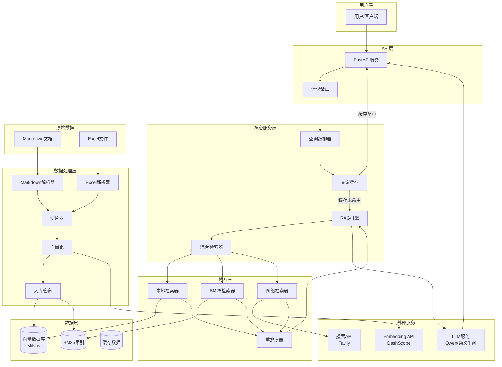
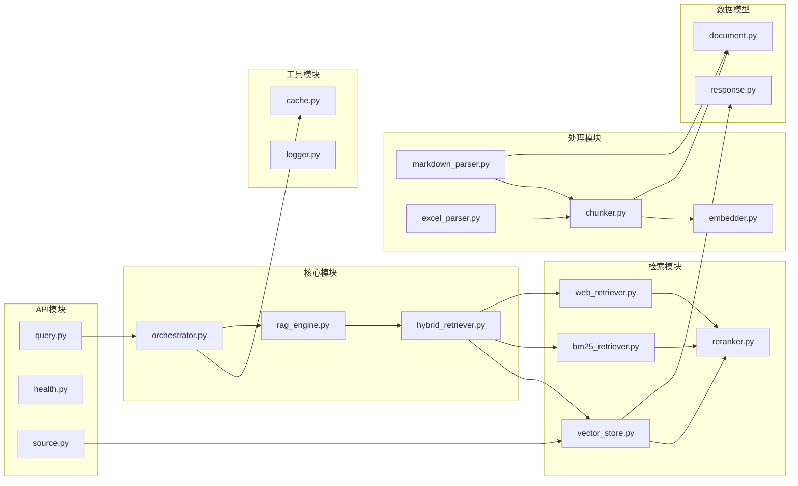
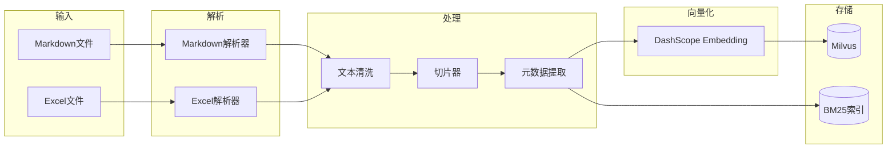
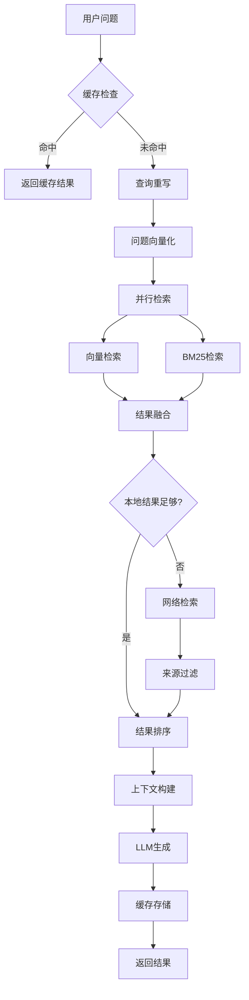

# DESIGN - 工程质检RAG系统

## 一、整体架构图



## 二、分层设计

### 2.1 目录结构

```
工程质检RAG系统/
├── app/
│   ├── __init__.py
│   ├── main.py                 # FastAPI入口
│   ├── config.py               # 配置管理
│   ├── api/
│   │   ├── __init__.py
│   │   ├── routes/
│   │   │   ├── query.py        # 问答接口（含流式）
│   │   │   ├── health.py       # 健康检查
│   │   │   └── source.py       # 来源追溯
│   │   └── deps.py             # 依赖注入
│   ├── core/
│   │   ├── __init__.py
│   │   ├── orchestrator.py     # 查询编排器（含缓存）
│   │   ├── rag_engine.py       # RAG引擎（含流式生成）
│   │   └── hybrid_retriever.py # 混合检索器（并行执行）
│   ├── retrievers/
│   │   ├── __init__.py
│   │   ├── vector_store.py     # Milvus向量存储
│   │   ├── local_retriever.py  # 本地检索
│   │   ├── bm25_retriever.py   # BM25检索
│   │   ├── web_retriever.py    # 网络检索
│   │   └── reranker.py         # 重排序
│   ├── processors/
│   │   ├── __init__.py
│   │   ├── markdown_parser.py  # Markdown解析
│   │   ├── excel_parser.py     # Excel解析
│   │   ├── chunker.py          # 切片器
│   │   ├── embedder.py         # 向量化
│   │   └── query_rewriter.py   # 查询重写器
│   ├── models/
│   │   ├── __init__.py
│   │   ├── document.py         # 文档模型
│   │   └── response.py         # 响应模型
│   └── utils/
│       ├── __init__.py
│       ├── logger.py           # 日志
│       ├── cache.py            # 查询缓存
│       └── helpers.py          # 工具函数
├── data/
│   ├── raw/                    # 原始数据
│   ├── processed/              # 处理后数据
│   └── vectordb/               # BM25索引
├── volumes/                    # Milvus数据卷
├── scripts/
│   └── ingest.py               # 数据入库脚本
├── docs/                       # 项目文档
├── docker-compose.yml          # Milvus Docker配置
├── test_api.py                 # 测试脚本
├── .env.example
├── requirements.txt
└── README.md
```

### 2.2 核心组件说明

| 组件 | 职责 | 关键技术 |
|------|------|---------|
| FastAPI服务 | HTTP接口暴露、请求处理 | FastAPI, Pydantic |
| 查询编排器 | 协调检索、生成流程，缓存管理 | 状态机模式 |
| RAG引擎 | 检索增强生成核心逻辑，流式输出 | DashScope API |
| 混合检索器 | 本地+网络检索协调，并行执行 | ThreadPoolExecutor |
| 向量存储 | Milvus向量数据库操作 | pymilvus |
| BM25检索器 | 关键词检索 | rank_bm25, jieba |
| 网络检索器 | 外部搜索API调用 | Tavily API |
| 重排序器 | 结果排序优化 | 本地优先策略 |
| Markdown解析器 | Markdown文档解析 | 正则表达式 |
| Excel解析器 | Excel文件解析 | pandas |
| 切片器 | 文本分块 | 固定大小切分 |
| 向量化 | 文本转向量 | DashScope Embedding |
| 查询缓存 | 缓存热门查询结果 | 内存缓存，MD5键 |

## 三、模块依赖关系图



## 四、接口契约定义

### 4.1 问答接口

**POST /api/v1/query**

请求：
```json
{
    "question": "土方路基压实度检测频率是多少？",
    "options": {
        "use_web_search": true,
        "top_k": 5
    }
}
```

响应：
```json
{
    "code": 0,
    "data": {
        "answer": "根据JTG F80-1-2017《公路工程质量检验评定标准》...",
        "sources": [
            {
                "doc_id": "JTG_F80-1-2017",
                "doc_name": "公路工程质量检验评定标准 第一册 土建工程",
                "page": 15,
                "section": "4.2.2",
                "content": "土方路基压实度检测频率...",
                "source_type": "local"
            }
        ],
        "query_time_ms": 1234,
        "used_web_search": false
    }
}
```

### 4.2 流式问答接口

**POST /api/v1/query/stream**

请求：
```json
{
    "question": "土方路基压实度检测频率是多少？",
    "options": {
        "use_web_search": true,
        "top_k": 5
    }
}
```

响应（SSE流式）：
```
event: message
data: {"type": "answer", "content": "根据JTG F80-1-2017..."}

event: message
data: {"type": "answer", "content": "《公路工程质量检验评定标准》..."}

event: done
data: {"sources": [...], "query_time_ms": 1234, "used_web_search": false}
```

### 4.3 来源追溯接口

**GET /api/v1/source/{chunk_id}**

响应：
```json
{
    "code": 0,
    "data": {
        "chunk_id": "chunk_001",
        "doc_id": "JTG_F80-1-2017",
        "doc_name": "公路工程质量检验评定标准",
        "page": 15,
        "section": "4.2.2 土方路基",
        "full_content": "...完整段落内容..."
    }
}
```

### 4.4 健康检查接口

**GET /api/v1/health**

响应：
```json
{
    "status": "healthy",
    "components": {
        "vector_store": "ok",
        "bm25_index": "ok",
        "llm": "ok"
    },
    "stats": {
        "total_chunks": 2067,
        "total_docs": 13
    }
}
```

## 五、数据流向图

### 5.1 数据入库流程



### 5.2 查询处理流程



## 六、异常处理策略

### 6.1 异常分类

| 异常类型 | 处理策略 | 用户提示 |
|---------|---------|---------|
| Markdown解析失败 | 记录日志，跳过该文件 | 入库报告中标注 |
| Embedding API超时 | 重试3次 | 响应时间延长 |
| LLM调用失败 | 返回检索结果，标注生成失败 | "检索到相关内容，但无法生成总结" |
| 网络检索失败 | 仅返回本地结果 | "网络检索暂时不可用" |
| Milvus查询失败 | 降级到BM25检索 | "使用备用检索方式" |

### 6.2 降级策略

```python
class DegradationStrategy:
    def get_retriever(self):
        if self.milvus_available:
            return HybridRetriever()  # 向量 + BM25
        elif self.bm25_available:
            return BM25Retriever()  # 仅BM25
        else:
            return WebOnlyRetriever()  # 仅网络
    
    def get_cache(self):
        if self.cache_available:
            return MemoryCache()
        else:
            return NoCache()
```

## 七、性能指标

| 指标 | 目标值 | 实际值 | 测量方法 |
|------|--------|--------|---------|
| 单次问答延迟 | <20秒 | <10秒 | API响应时间 |
| 缓存命中延迟 | <100ms | <100ms | 缓存命中测试 |
| 检索准确率 | ≥80% | 待测试 | 测试集评估 |
| 向量化吞吐 | >100 chunks/s | ~50 chunks/s | 批量处理测试 |
| 并发支持 | 10 QPS | 支持 | 压力测试 |

---

**文档版本**：v1.1  
**创建时间**：2026-04-05  
**更新时间**：2026-04-06  
**状态**：已实现
