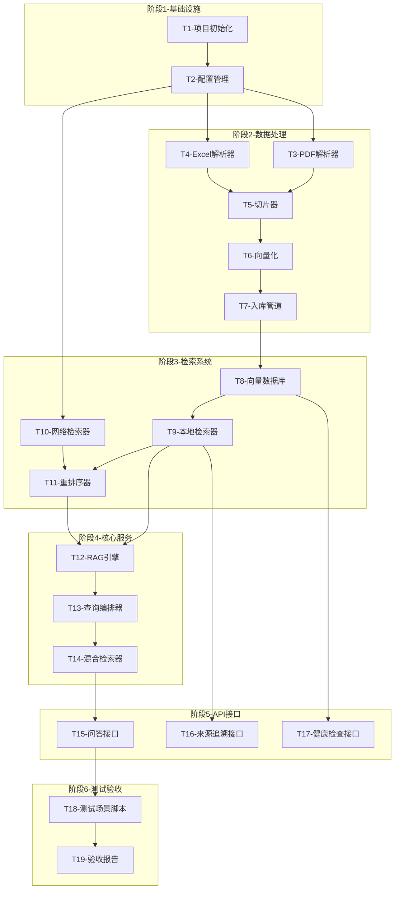

# TASK - 工程质检RAG系统

## 一、任务依赖关系图

## 二、原子任务详细定义

### T1 - 项目初始化

**输入契约：**
- 无

**输出契约：**
- 完整的项目目录结构
- requirements.txt 依赖清单
- .env.example 配置模板

**实现约束：**
- 使用Python 3.10+
- 遵循目录结构规范
- 依赖版本锁定

**验收标准：**
- [ ] 目录结构完整
- [ ] pip install -r requirements.txt 成功
- [ ] .env.example 包含所有必要配置项

**预估时间：** 15分钟

---

### T2 - 配置管理

**输入契约：**
- 项目目录结构
- .env.example

**输出契约：**
- app/config.py 配置模块
- 支持环境变量加载
- 配置验证

**实现约束：**
- 使用 pydantic-settings
- 敏感信息从环境变量读取
- 提供默认值

**验收标准：**
- [ ] 配置项类型正确
- [ ] 环境变量覆盖生效
- [ ] 缺少必要配置时报错

**依赖：** T1

**预估时间：** 20分钟

---

### T3 - PDF解析器

**输入契约：**
- PDF文件路径
- 配置信息

**输出契约：**
- 解析后的文档对象列表
- 每个对象包含：文档名、页码、文本内容、表格数据

**实现约束：**
- 使用 PyMuPDF (fitz)
- 支持文本和表格提取
- 保留文档结构信息

**验收标准：**
- [ ] 成功解析所有11个PDF
- [ ] 表格数据提取正确
- [ ] 页码信息准确

**依赖：** T2

**预估时间：** 45分钟

---

### T4 - Excel解析器

**输入契约：**
- Excel文件路径
- 配置信息

**输出契约：**
- 解析后的结构化数据
- 每行转换为描述性文本

**实现约束：**
- 使用 pandas
- 处理合并单元格
- 保留列名作为上下文

**验收标准：**
- [ ] 成功解析所有3个Excel
- [ ] 数据完整无丢失
- [ ] 生成的描述文本可读

**依赖：** T2

**预估时间：** 30分钟

---

### T5 - 切片器

**输入契约：**
- 解析后的文档对象
- 切片配置（大小、重叠）

**输出契约：**
- 切片对象列表
- 每个切片包含：内容、元数据（来源、页码、章节）

**实现约束：**
- PDF按段落/章节切分
- Excel按行记录切分
- 切片大小：500-1000字符
- 重叠：100字符

**验收标准：**
- [ ] 切片大小在配置范围内
- [ ] 元数据完整
- [ ] 无重复切片

**依赖：** T3, T4

**预估时间：** 40分钟

---

### T6 - 向量化

**输入契约：**
- 切片对象列表
- Embedding API配置

**输出契约：**
- 切片+向量对列表

**实现约束：**
- 支持 OpenAI text-embedding-3-small
- 支持备用 BGE-large-zh
- 批量处理优化

**验收标准：**
- [ ] 向量维度正确
- [ ] 批量处理无错误
- [ ] 失败重试机制

**依赖：** T5

**预估时间：** 30分钟

---

### T7 - 入库管道

**输入契约：**
- 切片+向量对
- 向量数据库配置

**输出契约：**
- 入库完成的向量数据库
- 入库报告（文档数、切片数、失败数）

**实现约束：**
- 使用 ChromaDB
- 持久化存储
- 去重处理

**验收标准：**
- [ ] 所有切片入库成功
- [ ] 元数据完整保存
- [ ] 入库报告准确

**依赖：** T6

**预估时间：** 30分钟

---

### T8 - 向量数据库封装

**输入契约：**
- ChromaDB实例
- 配置信息

**输出契约：**
- 向量数据库操作类
- 支持增删改查

**实现约束：**
- 封装为统一接口
- 支持元数据过滤
- 支持批量操作

**验收标准：**
- [ ] CRUD操作正常
- [ ] 元数据过滤生效
- [ ] 查询性能达标

**依赖：** T7

**预估时间：** 30分钟

---

### T9 - 本地检索器

**输入契约：**
- 查询向量
- 检索参数（top_k, filters）

**输出契约：**
- 检索结果列表
- 每个结果包含：内容、元数据、相似度分数

**实现约束：**
- 使用余弦相似度
- 支持元数据过滤
- 返回来源信息

**验收标准：**
- [ ] 检索结果相关
- [ ] 相似度分数合理
- [ ] 来源信息完整

**依赖：** T8

**预估时间：** 30分钟

---

### T10 - 网络检索器

**输入契约：**
- 查询文本
- 搜索API配置

**输出契约：**
- 搜索结果列表
- 每个结果包含：内容、来源URL、标题

**实现约束：**
- 使用 Tavily API
- 过滤权威来源
- 结果数量限制

**验收标准：**
- [ ] API调用成功
- [ ] 来源可追溯
- [ ] 结果相关

**依赖：** T2

**预估时间：** 40分钟

---

### T11 - 重排序器

**输入契约：**
- 本地检索结果
- 网络检索结果
- 原始查询

**输出契约：**
- 重排序后的结果列表
- 本地结果优先

**实现约束：**
- 本地结果权重更高
- 网络结果标注来源类型
- 结果去重

**验收标准：**
- [ ] 排序合理
- [ ] 本地优先
- [ ] 无重复

**依赖：** T9, T10

**预估时间：** 25分钟

---

### T12 - RAG引擎

**输入契约：**
- 检索结果
- 原始查询
- LLM配置

**输出契约：**
- 生成的答案
- 引用的来源

**实现约束：**
- 使用 LangChain
- Prompt模板优化
- 支持流式输出

**验收标准：**
- [ ] 答案相关准确
- [ ] 引用正确
- [ ] 响应时间<3秒

**依赖：** T9, T11

**预估时间：** 45分钟

---

### T13 - 查询编排器

**输入契约：**
- 用户查询
- 配置选项

**输出契约：**
- 完整的查询响应

**实现约束：**
- 协调检索和生成流程
- 处理异常降级
- 记录查询日志

**验收标准：**
- [ ] 流程完整
- [ ] 异常处理正确
- [ ] 日志完整

**依赖：** T12

**预估时间：** 30分钟

---

### T14 - 混合检索器

**输入契约：**
- 查询文本
- 检索选项

**输出契约：**
- 混合检索结果

**实现约束：**
- 本地优先策略
- 网络检索触发条件
- 结果合并逻辑

**验收标准：**
- [ ] 策略执行正确
- [ ] 结果合并合理
- [ ] 来源标注清晰

**依赖：** T13

**预估时间：** 30分钟

---

### T15 - 问答接口

**输入契约：**
- HTTP请求
- 查询参数

**输出契约：**
- JSON响应
- 答案+来源

**实现约束：**
- 使用 FastAPI
- Pydantic模型验证
- 异步处理

**验收标准：**
- [ ] 接口响应正确
- [ ] 错误处理完善
- [ ] 文档自动生成

**依赖：** T14

**预估时间：** 30分钟

---

### T16 - 来源追溯接口

**输入契约：**
- chunk_id

**输出契约：**
- 完整的来源信息
- 原始文档片段

**实现约束：**
- 支持上下文展示
- 支持原文定位

**验收标准：**
- [ ] 来源信息准确
- [ ] 上下文完整
- [ ] 响应快速

**依赖：** T9

**预估时间：** 20分钟

---

### T17 - 健康检查接口

**输入契约：**
- 无

**输出契约：**
- 系统状态
- 组件健康状态
- 统计信息

**实现约束：**
- 检查所有组件
- 返回详细状态

**验收标准：**
- [ ] 状态准确
- [ ] 响应快速
- [ ] 统计正确

**依赖：** T8

**预估时间：** 15分钟

---

### T18 - 测试场景脚本

**输入契约：**
- 完整系统
- 测试场景定义

**输出契约：**
- 测试结果
- 准确率计算

**实现约束：**
- 5个验收场景
- 自动化执行
- 结果报告

**验收标准：**
- [ ] 5个场景全部执行
- [ ] 准确率≥80%
- [ ] 报告清晰

**依赖：** T15

**预估时间：** 45分钟

---

### T19 - 验收报告

**输入契约：**
- 测试结果
- 系统实现

**输出契约：**
- 完整验收报告
- TODO清单

**实现约束：**
- 包含所有验收项
- 标注通过/失败
- 列出待改进项

**验收标准：**
- [ ] 报告完整
- [ ] 结论明确
- [ ] TODO清晰

**依赖：** T18

**预估时间：** 20分钟

---

## 三、时间估算汇总

| 阶段 | 任务 | 预估时间 |
|------|------|---------|
| 基础设施 | T1, T2 | 35分钟 |
| 数据处理 | T3-T7 | 175分钟 |
| 检索系统 | T8-T11 | 125分钟 |
| 核心服务 | T12-T14 | 105分钟 |
| API接口 | T15-T17 | 65分钟 |
| 测试验收 | T18-T19 | 65分钟 |
| **总计** | | **约9.5小时** |

---

**文档版本**：v1.0  
**创建时间**：2026-04-05  
**状态**：待确认
