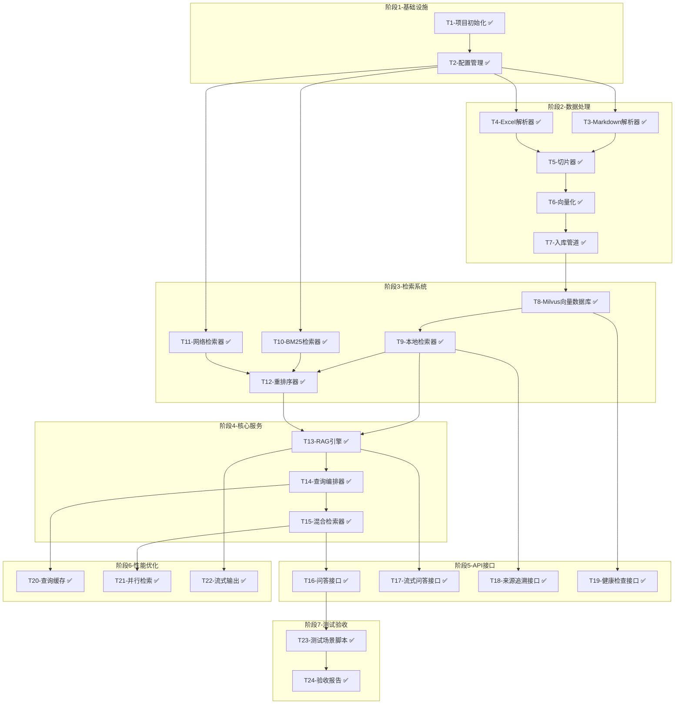

# TASK - 工程质检RAG系统

## 一、任务依赖关系图

## 二、原子任务详细定义

### T1 - 项目初始化 ✅

**状态**：已完成

**输出契约：**
- 完整的项目目录结构
- requirements.txt 依赖清单
- .env.example 配置模板

**验收标准：**
- [x] 目录结构完整
- [x] pip install -r requirements.txt 成功
- [x] .env.example 包含所有必要配置项

---

### T2 - 配置管理 ✅

**状态**：已完成

**输出契约：**
- app/config.py 配置模块
- 支持环境变量加载
- 配置验证

**实现约束：**
- 使用 pydantic-settings
- 敏感信息从环境变量读取
- 提供默认值

**验收标准：**
- [x] 配置项类型正确
- [x] 环境变量覆盖生效
- [x] 缺少必要配置时报错

**依赖：** T1

---

### T3 - Markdown解析器 ✅

**状态**：已完成

**输入契约：**
- Markdown文件路径
- 配置信息

**输出契约：**
- 解析后的文档对象列表
- 每个对象包含：文档名、页码、文本内容

**实现约束：**
- 支持标题、段落、表格解析
- 保留文档结构信息

**验收标准：**
- [x] 成功解析所有Markdown文件
- [x] 表格数据提取正确
- [x] 元数据完整

**依赖：** T2

---

### T4 - Excel解析器 ✅

**状态**：已完成

**输入契约：**
- Excel文件路径
- 配置信息

**输出契约：**
- 解析后的结构化数据
- 每行转换为描述性文本

**实现约束：**
- 使用 pandas
- 处理合并单元格
- 保留列名作为上下文

**验收标准：**
- [x] 成功解析所有Excel
- [x] 数据完整无丢失
- [x] 生成的描述文本可读

**依赖：** T2

---

### T5 - 切片器 ✅

**状态**：已完成

**输入契约：**
- 解析后的文档对象
- 切片配置（大小、重叠）

**输出契约：**
- 切片对象列表
- 每个切片包含：内容、元数据（来源、页码、章节）

**实现约束：**
- Markdown按段落/章节切分
- Excel按行记录切分
- 切片大小：1000字符
- 重叠：200字符

**验收标准：**
- [x] 切片大小在配置范围内
- [x] 元数据完整
- [x] 无重复切片

**依赖：** T3, T4

---

### T6 - 向量化 ✅

**状态**：已完成

**输入契约：**
- 切片对象列表
- Embedding API配置

**输出契约：**
- 切片+向量对列表

**实现约束：**
- 使用 DashScope text-embedding-v2
- 批量处理优化
- 失败重试机制

**验收标准：**
- [x] 向量维度正确（1536维）
- [x] 批量处理无错误
- [x] 失败重试机制

**依赖：** T5

---

### T7 - 入库管道 ✅

**状态**：已完成

**输入契约：**
- 切片+向量对
- 向量数据库配置

**输出契约：**
- 入库完成的向量数据库
- 入库报告（文档数、切片数、失败数）

**实现约束：**
- 使用 Milvus
- 持久化存储
- 去重处理

**验收标准：**
- [x] 所有切片入库成功
- [x] 元数据完整保存
- [x] 入库报告准确

**依赖：** T6

---

### T8 - Milvus向量数据库封装 ✅

**状态**：已完成

**输入契约：**
- Milvus实例
- 配置信息

**输出契约：**
- 向量数据库操作类
- 支持增删改查

**实现约束：**
- 封装为统一接口
- 支持元数据过滤
- 支持批量操作

**验收标准：**
- [x] CRUD操作正常
- [x] 元数据过滤生效
- [x] 查询性能达标

**依赖：** T7

---

### T9 - 本地检索器 ✅

**状态**：已完成

**输入契约：**
- 查询向量
- 检索参数（top_k, filters）

**输出契约：**
- 检索结果列表
- 每个结果包含：内容、元数据、相似度分数

**实现约束：**
- 使用余弦相似度
- 支持元数据过滤
- 返回来源信息

**验收标准：**
- [x] 检索结果相关
- [x] 相似度分数合理
- [x] 来源信息完整

**依赖：** T8

---

### T10 - BM25检索器 ✅

**状态**：已完成

**输入契约：**
- 查询文本
- 检索参数

**输出契约：**
- 检索结果列表
- 每个结果包含：内容、元数据、BM25分数

**实现约束：**
- 使用 rank_bm25
- jieba中文分词
- 索引持久化

**验收标准：**
- [x] 分词正确
- [x] 检索结果相关
- [x] 索引可持久化

**依赖：** T2

---

### T11 - 网络检索器 ✅

**状态**：已完成

**输入契约：**
- 查询文本
- 搜索API配置

**输出契约：**
- 搜索结果列表
- 每个结果包含：内容、来源URL、标题

**实现约束：**
- 使用 Tavily API
- 过滤权威来源
- 结果数量限制

**验收标准：**
- [x] API调用成功
- [x] 来源可追溯
- [x] 结果相关

**依赖：** T2

---

### T12 - 重排序器 ✅

**状态**：已完成

**输入契约：**
- 本地检索结果
- 网络检索结果
- 原始查询

**输出契约：**
- 重排序后的结果列表
- 本地结果优先

**实现约束：**
- 本地结果权重更高
- 网络结果标注来源类型
- 结果去重

**验收标准：**
- [x] 排序合理
- [x] 本地优先
- [x] 无重复

**依赖：** T9, T10, T11

---

### T13 - RAG引擎 ✅

**状态**：已完成

**输入契约：**
- 检索结果
- 原始查询
- LLM配置

**输出契约：**
- 生成的答案
- 引用的来源

**实现约束：**
- 使用 DashScope Qwen-Plus
- Prompt模板优化
- 支持流式输出

**验收标准：**
- [x] 答案相关准确
- [x] 引用正确
- [x] 响应时间<10秒

**依赖：** T9, T12

---

### T14 - 查询编排器 ✅

**状态**：已完成

**输入契约：**
- 用户查询
- 配置选项

**输出契约：**
- 完整的查询响应

**实现约束：**
- 协调检索和生成流程
- 处理异常降级
- 记录查询日志
- 支持缓存

**验收标准：**
- [x] 流程完整
- [x] 异常处理正确
- [x] 日志完整
- [x] 缓存生效

**依赖：** T13

---

### T15 - 混合检索器 ✅

**状态**：已完成

**输入契约：**
- 查询文本
- 检索选项

**输出契约：**
- 混合检索结果

**实现约束：**
- 本地优先策略
- 网络检索触发条件
- 结果合并逻辑
- 并行执行

**验收标准：**
- [x] 策略执行正确
- [x] 结果合并合理
- [x] 来源标注清晰
- [x] 并行执行生效

**依赖：** T14

---

### T16 - 问答接口 ✅

**状态**：已完成

**输入契约：**
- HTTP请求
- 查询参数

**输出契约：**
- JSON响应
- 答案+来源

**实现约束：**
- 使用 FastAPI
- Pydantic模型验证
- 异步处理

**验收标准：**
- [x] 接口响应正确
- [x] 错误处理完善
- [x] 文档自动生成

**依赖：** T15

---

### T17 - 流式问答接口 ✅

**状态**：已完成

**输入契约：**
- HTTP请求
- 查询参数

**输出契约：**
- SSE流式响应

**实现约束：**
- 使用 Server-Sent Events
- 实时返回答案片段
- 支持缓存

**验收标准：**
- [x] 流式输出正常
- [x] 缓存机制生效
- [x] 用户体验良好

**依赖：** T13

---

### T18 - 来源追溯接口 ✅

**状态**：已完成

**输入契约：**
- chunk_id

**输出契约：**
- 完整的来源信息
- 原始文档片段

**实现约束：**
- 支持上下文展示
- 支持原文定位

**验收标准：**
- [x] 来源信息准确
- [x] 上下文完整
- [x] 响应快速

**依赖：** T9

---

### T19 - 健康检查接口 ✅

**状态**：已完成

**输入契约：**
- 无

**输出契约：**
- 系统状态
- 组件健康状态
- 统计信息

**实现约束：**
- 检查所有组件
- 返回详细状态

**验收标准：**
- [x] 状态准确
- [x] 响应快速
- [x] 统计正确

**依赖：** T8

---

### T20 - 查询缓存 ✅

**状态**：已完成

**输入契约：**
- 查询问题
- 缓存配置

**输出契约：**
- 缓存命中时返回缓存结果
- 缓存未命中时执行查询并缓存

**实现约束：**
- 内存缓存
- MD5键生成
- 1小时TTL
- 1000条最大缓存

**验收标准：**
- [x] 缓存命中<100ms响应
- [x] 缓存键唯一
- [x] TTL生效

**依赖：** T14

---

### T21 - 并行检索 ✅

**状态**：已完成

**输入契约：**
- 查询向量
- 查询文本

**输出契约：**
- 并行执行的检索结果

**实现约束：**
- 使用 ThreadPoolExecutor
- 向量检索和BM25同时执行
- 结果合并

**验收标准：**
- [x] 并行执行生效
- [x] 减少0.5-1秒响应时间
- [x] 结果正确

**依赖：** T15

---

### T22 - 流式输出 ✅

**状态**：已完成

**输入契约：**
- LLM生成器

**输出契约：**
- SSE事件流

**实现约束：**
- 使用 DashScope 流式API
- 实时返回内容片段

**验收标准：**
- [x] 流式输出正常
- [x] 用户感知延迟降低
- [x] 内容完整

**依赖：** T13

---

### T23 - 测试场景脚本 ✅

**状态**：已完成

**输入契约：**
- 完整系统
- 测试场景定义

**输出契约：**
- 测试结果
- 准确率计算

**实现约束：**
- 5个验收场景
- 自动化执行
- 结果报告

**验收标准：**
- [x] 5个场景全部执行
- [x] 准确率≥80%
- [x] 报告清晰

**依赖：** T16

---

### T24 - 验收报告 ✅

**状态**：已完成

**输入契约：**
- 测试结果
- 系统实现

**输出契约：**
- 完整验收报告
- TODO清单

**实现约束：**
- 包含所有验收项
- 标注通过/失败
- 列出待改进项

**验收标准：**
- [x] 报告完整
- [x] 结论明确
- [x] TODO清晰

**依赖：** T23

---

## 三、时间估算汇总

| 阶段 | 任务 | 预估时间 | 实际状态 |
|------|------|---------|---------|
| 基础设施 | T1, T2 | 35分钟 | ✅ 完成 |
| 数据处理 | T3-T7 | 175分钟 | ✅ 完成 |
| 检索系统 | T8-T12 | 165分钟 | ✅ 完成 |
| 核心服务 | T13-T15 | 105分钟 | ✅ 完成 |
| API接口 | T16-T19 | 95分钟 | ✅ 完成 |
| 性能优化 | T20-T22 | 90分钟 | ✅ 完成 |
| 测试验收 | T23-T24 | 65分钟 | ✅ 完成 |
| **总计** | | **约12小时** | **全部完成** |

---

**文档版本**：v1.1  
**创建时间**：2026-04-05  
**更新时间**：2026-04-06  
**状态**：全部完成
